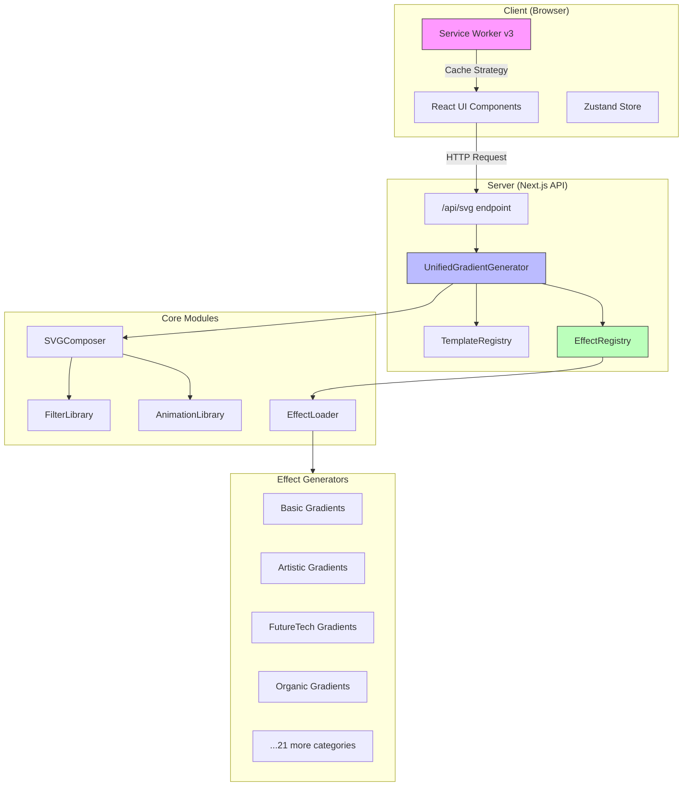
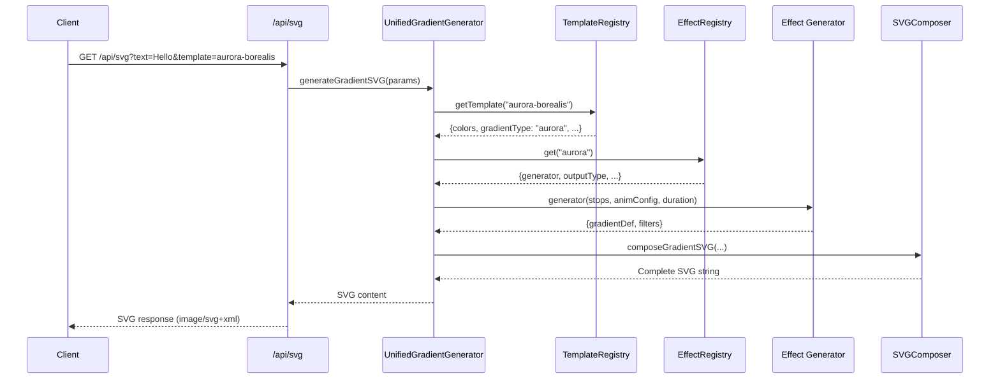
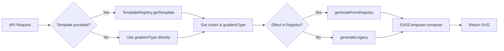
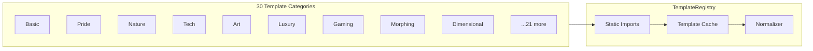
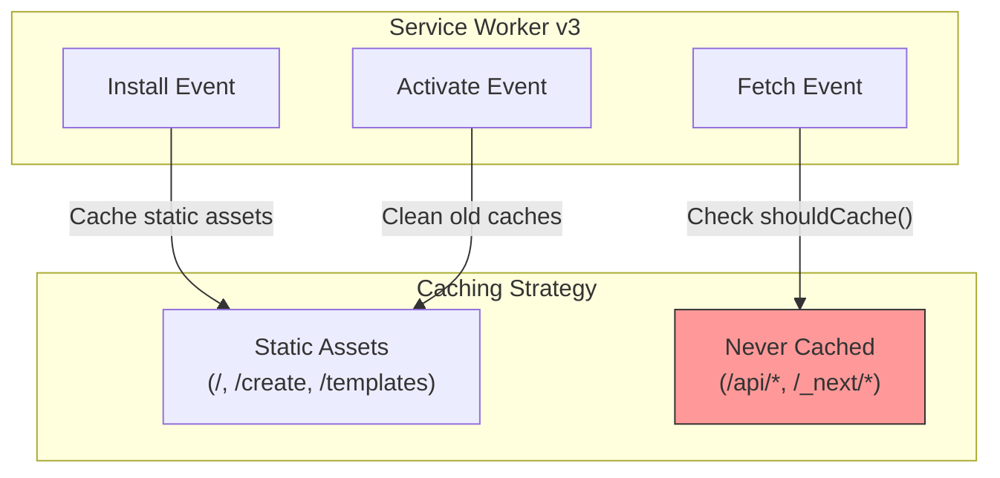

# CLAUDE.md

This file provides guidance to Claude Code (claude.ai/code) when working with code in this repository.

## Project Overview

Gradient SVG Generator is a Next.js 13 application that creates animated SVG gradients with customizable text overlays. It features **326+ templates** across **30 categories** and supports **200+ gradient types** with advanced visual effects.

### Tech Stack
- **Frontend**: React 18.2 with Next.js 13
- **UI Framework**: Tailwind CSS with CSS Modules
- **Animation**: Framer Motion for UI animations, CSS/SVG animations for effects
- **State Management**: Zustand with persistence
- **PWA**: Service Worker for offline support
- **Build Tools**: Webpack, PostCSS

## Development Commands

```bash
# Install dependencies
npm install

# Start development server (http://localhost:3000)
npm run dev

# Build for production
npm run build

# Start production server
npm start
```

## System Architecture

### High-Level Architecture



### SVG Generation Pipeline



## Key Architecture Points

### API Endpoint
The main API is at `/api/svg` (src/pages/api/svg.js) which accepts query parameters:
- `text`: Display text (required)
- `height`: 30-300px (default: 120)
- `template`: Template name (e.g., "aurora-borealis", "hologram-matrix")
- `gradientType`: Gradient type (e.g., "horizontal", "aurora", "hologram")
- `duration`: Animation duration (e.g., "6s")
- `color0`, `color1`, etc.: Hex colors without #

### Core Generation Flow



### Core Modules (src/core/)

| Module | Purpose |
|--------|---------|
| `UnifiedGradientGenerator.js` | Main entry point, orchestrates SVG generation |
| `EffectRegistry.js` | Central registry mapping effect names to generators |
| `EffectLoader.js` | Loads and registers all effect generators |
| `TemplateRegistry.js` | Manages template loading with static imports |
| `FilterLibrary.js` | Centralized SVG filter definitions |
| `AnimationLibrary.js` | Reusable animation patterns and utilities |
| `SVGComposer.js` | Composes complete SVG documents |

### Template System



- Templates organized by category in `src/templates/` (30 categories)
- **Static imports** used in TemplateRegistry for Webpack bundling compatibility
- Template structure: `{ name, label, colors, gradientType, animationDuration, description }`
- Auto-registered via the config system

### Service Worker (PWA)

The project uses a Service Worker (`public/sw.js`) for PWA functionality:



**Important**: API routes (`/api/*`) are **never cached** to ensure fresh SVG responses.

## Directory Structure

```
src/
├── core/                    # Core architecture modules
│   ├── UnifiedGradientGenerator.js
│   ├── EffectRegistry.js
│   ├── EffectLoader.js
│   ├── TemplateRegistry.js
│   ├── FilterLibrary.js
│   ├── AnimationLibrary.js
│   └── SVGComposer.js
├── templates/               # 30 template category files
│   ├── basicTemplates.js
│   ├── prideTemplates.js
│   ├── natureTemplates.js
│   └── ... (27 more)
├── utils/
│   ├── gradientGenerators/  # 21 effect generator files
│   │   ├── basicGradients.js
│   │   ├── artisticGradients.js
│   │   └── ... (19 more)
│   ├── colorUtils.js
│   ├── svgUtils.js
│   └── templateUtils.js
├── pages/
│   ├── index.js            # Home page
│   ├── create.js           # Advanced creation interface
│   ├── templates.js        # Template gallery
│   └── api/svg.js          # SVG generation API
├── components/
│   ├── layout/             # Header, Sidebar, Footer
│   ├── features/           # Feature components
│   └── ui/                 # shadcn/ui components
├── store/
│   └── useStore.js         # Zustand state management
└── styles/                 # CSS Modules
```

## Adding New Features

### New Gradient Type
1. Create generator in `src/utils/gradientGenerators/`
2. Register in `src/core/EffectLoader.js`
3. Add to `GRADIENT_TYPES` in `src/config/gradientConfig.js`

### New Template
1. Add to appropriate category file in `src/templates/`
2. Static import is already in `TemplateRegistry.js`
3. Templates auto-register via the config system

### New Effect Category
1. Create new generator file in `src/utils/gradientGenerators/`
2. Create new template file in `src/templates/`
3. Add static import to `src/core/TemplateRegistry.js`
4. Add load function to `src/core/EffectLoader.js`

## Important Patterns

- **Static imports** in TemplateRegistry (not dynamic require)
- SVG generation is **server-side only**
- API routes are **excluded from Service Worker cache**
- Filter effects use unique IDs in SVG `<defs>` to avoid conflicts
- Use `FilterLibrary` and `AnimationLibrary` for reusable patterns
- Mobile-first responsive design with dedicated mobile components

## Testing Approach

When testing changes:
1. Test with various text lengths (short, medium, long)
2. Test all color combinations in templates
3. Verify animations work smoothly
4. Check SVG validity (well-formed XML)
5. Test API endpoint with different parameter combinations
6. Test in **incognito mode** to bypass Service Worker cache
7. Clear Service Worker via DevTools > Application if needed

## Development Guidelines

### Language Requirements
- **All text content in pages and components must be in English**
- No Chinese characters in user-facing content

### Git Workflow
- Use **Conventional Commits** format:
  - `feat:` New features
  - `fix:` Bug fixes
  - `docs:` Documentation changes
  - `refactor:` Code refactoring
  - `chore:` Maintenance tasks

## Current Feature Set

### Statistics
- **326+ Templates** across 30 categories
- **200+ Gradient Types** with unique effects
- **50+ Animation Effects**

### Gradient Categories
| Category | Examples |
|----------|----------|
| Basic | horizontal, vertical, diagonal, radial |
| Shapes | star, heart, lightning, wave |
| Artistic | watercolor, oil paint, graffiti |
| Tech | hologram, quantum, neural network |
| Gaming | pixel art, neon arcade, cyberpunk |
| Organic | aurora, flame, flowing water |
| Dimensional | portal, wormhole, fractal |
| Consciousness | thought waves, dream logic |

### User Features
- Real-time preview with live updates
- Favorites and recent history (persisted)
- Responsive design (desktop + mobile)
- Direct SVG download
- PWA support for offline access
