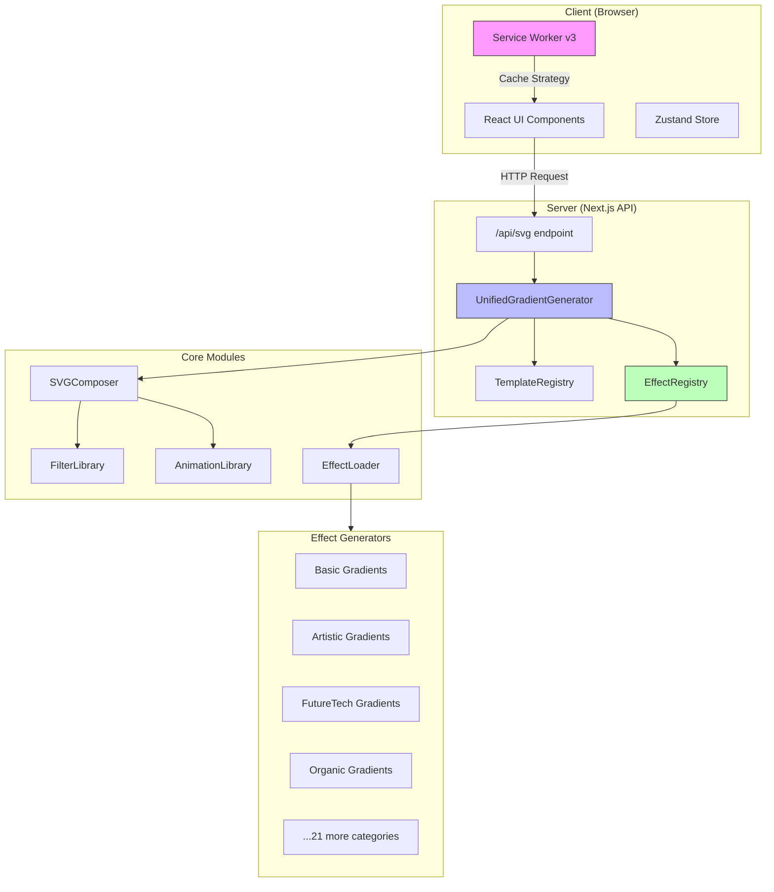
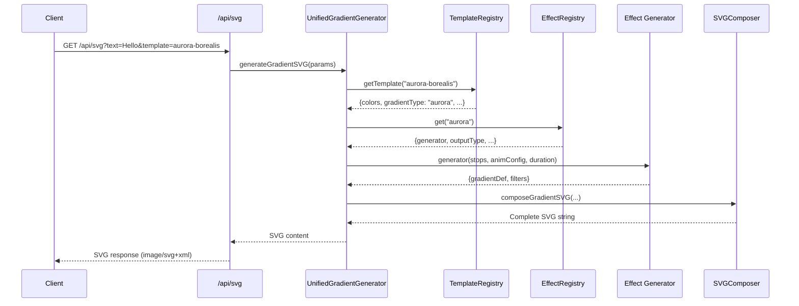
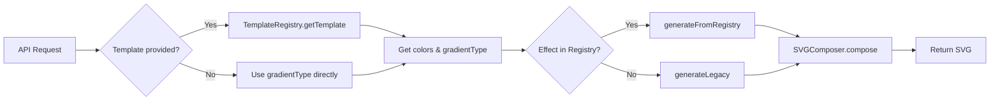
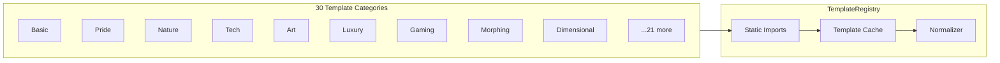
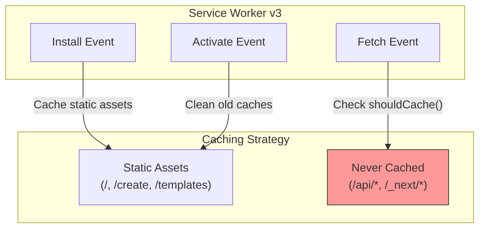

# CLAUDE.md

This file provides guidance to Claude Code (claude.ai/code) when working with code in this repository.

## Project Overview

Chromaflow is a Next.js 16 application that creates animated SVG gradients with customizable text overlays. It features **340+ templates** across **19 categories** and supports **180+ gradient types** with advanced visual effects.

### Tech Stack

- **Frontend**: React 19 with Next.js 16 (Pages Router)
- **Language**: TypeScript (strict, `allowJs` gradual migration) + legacy JavaScript
- **UI Framework**: Tailwind CSS v4 (CSS-first `@theme`), shadcn/ui primitives
- **Animation**: Framer Motion for UI animations, CSS/SVG animations for effects
- **State Management**: Zustand v5 with persistence
- **Testing**: Vitest + Testing Library + jsdom; contract snapshot harness for `/api/svg`
- **PWA**: Service Worker for offline support
- **Build Tools**: Next.js + webpack, PostCSS with `@tailwindcss/postcss`

## Development Commands

```bash
# Install dependencies
npm install

# Start development server (http://localhost:3000)
npm run dev

# Build for production
npm run build

# Start production server
npm start
```

## System Architecture

### High-Level Architecture


```mermaid
graph TB
    subgraph Client["Client (Browser)"]
        UI[React UI Components]
        SW[Service Worker v3]
        Store[Zustand Store]
    end

    subgraph Server["Server (Next.js API)"]
        API["/api/svg endpoint"]
        UGG[UnifiedGradientGenerator]
        TR[TemplateRegistry]
        ER[EffectRegistry]
    end

    subgraph Core["Core Modules"]
        FL[FilterLibrary]
        AL[AnimationLibrary]
        SC[SVGComposer]
        EL[EffectLoader]
    end

    subgraph Generators["Effect Generators"]
        BG[Basic Gradients]
        AG[Artistic Gradients]
        FT[FutureTech Gradients]
        OG[Organic Gradients]
        MORE[...21 more categories]
    end

    UI --> |HTTP Request| API
    SW --> |Cache Strategy| UI
    API --> UGG
    UGG --> TR
    UGG --> ER
    ER --> EL
    EL --> Generators
    UGG --> SC
    SC --> FL
    SC --> AL

    style SW fill:#f9f,stroke:#333
    style UGG fill:#bbf,stroke:#333
    style ER fill:#bfb,stroke:#333
```

### SVG Generation Pipeline


```mermaid
sequenceDiagram
    participant C as Client
    participant API as /api/svg
    participant UGG as UnifiedGradientGenerator
    participant TR as TemplateRegistry
    participant ER as EffectRegistry
    participant Gen as Effect Generator
    participant SC as SVGComposer

    C->>API: GET /api/svg?text=Hello&template=aurora-borealis
    API->>UGG: generateGradientSVG(params)
    UGG->>TR: getTemplate("aurora-borealis")
    TR-->>UGG: {colors, gradientType: "aurora", ...}
    UGG->>ER: get("aurora")
    ER-->>UGG: {generator, outputType, ...}
    UGG->>Gen: generator(stops, animConfig, duration)
    Gen-->>UGG: {gradientDef, filters}
    UGG->>SC: composeGradientSVG(...)
    SC-->>UGG: Complete SVG string
    UGG-->>API: SVG content
    API-->>C: SVG response (image/svg+xml)
```

## Key Architecture Points

### API Endpoint

The main API is at `/api/svg` (src/pages/api/svg.js) which accepts query parameters:

- `text`: Display text (required)
- `height`: 30-300px (default: 120)
- `template`: Template name (e.g., "aurora-borealis", "hologram-matrix")
- `gradientType`: Gradient type (e.g., "horizontal", "aurora", "hologram")
- `duration`: Animation duration (e.g., "6s")
- `color0`, `color1`, etc.: Hex colors without #

### Core Generation Flow


```mermaid
flowchart LR
    A[API Request] --> B{Template provided?}
    B -->|Yes| C[TemplateRegistry.getTemplate]
    B -->|No| D[Use gradientType directly]
    C --> E[Get colors & gradientType]
    D --> E
    E --> F{Effect in Registry?}
    F -->|Yes| G[generateFromRegistry]
    F -->|No| H[generateLegacy]
    G --> I[SVGComposer.compose]
    H --> I
    I --> J[Return SVG]
```

### Core Modules (src/core/)

| Module                        | Purpose                                             |
| ----------------------------- | --------------------------------------------------- |
| `UnifiedGradientGenerator.js` | Main entry point, orchestrates SVG generation       |
| `EffectRegistry.js`           | Central registry mapping effect names to generators |
| `EffectLoader.js`             | Loads and registers all effect generators           |
| `TemplateRegistry.js`         | Manages template loading with static imports        |
| `FilterLibrary.js`            | Centralized SVG filter definitions                  |
| `AnimationLibrary.js`         | Reusable animation patterns and utilities           |
| `SVGComposer.js`              | Composes complete SVG documents                     |

### Template System


```mermaid
graph LR
    subgraph Categories["30 Template Categories"]
        B[Basic]
        P[Pride]
        N[Nature]
        T[Tech]
        A[Art]
        L[Luxury]
        G[Gaming]
        M[Morphing]
        D[Dimensional]
        MORE2[...21 more]
    end

    subgraph Registry["TemplateRegistry"]
        STATIC[Static Imports]
        CACHE[Template Cache]
        NORM[Normalizer]
    end

    Categories --> STATIC
    STATIC --> CACHE
    CACHE --> NORM
```

- Templates are co-located with their generator under `src/features/<name>/templates.js` (19 feature folders)
- **Static imports** used in TemplateRegistry for Webpack bundling compatibility
- Template structure: `{ name, label, colors, gradientType, animationDuration, description }`
- Shared color palettes live in `src/features/_shared/palettes.js` and are referenced via `colors: palettes.prideRainbow` where multiple templates share the same sequence or the sequence has a canonical meaning
- Auto-registered via the config system

### Service Worker (PWA)

The project uses a Service Worker (`public/sw.js`) for PWA functionality:


```mermaid
flowchart TB
    subgraph SW["Service Worker v3"]
        direction TB
        INSTALL[Install Event]
        FETCH[Fetch Event]
        ACTIVATE[Activate Event]
    end

    subgraph Cache["Caching Strategy"]
        STATIC_CACHE["Static Assets<br/>(/, /create, /templates)"]
        NO_CACHE["Never Cached<br/>(/api/*, /_next/*)"]
    end

    INSTALL --> |"Cache static assets"| STATIC_CACHE
    FETCH --> |"Check shouldCache()"| NO_CACHE
    ACTIVATE --> |"Clean old caches"| STATIC_CACHE

    style NO_CACHE fill:#f99,stroke:#333
```

**Important**: API routes (`/api/*`) are **never cached** to ensure fresh SVG responses.

## Directory Structure

```
src/
├── core/                             # Core architecture modules
│   ├── UnifiedGradientGenerator.js   # Main entry — orchestrates SVG generation
│   ├── EffectRegistry.js             # Maps effect names -> generator functions
│   ├── EffectLoader.js               # Manifest-driven effect registration
│   ├── TemplateRegistry.js           # Manages template lookup with static imports
│   ├── FilterLibrary.js              # Backward-compat shim (re-exports ./filters)
│   ├── filters/                      # Per-primitive filter factories
│   │   ├── blur.js, turbulence.js, glow.js, shadow.js
│   │   ├── colorMatrix.js, lighting.js, morphology.js
│   │   ├── convolve.js, composite.js
│   │   ├── presets.js                # Static filter catalog (getAllFilters)
│   │   ├── lookups.js                # getFilter, getFilterUrl, ...
│   │   └── index.js                  # Barrel
│   ├── AnimationLibrary.js           # Reusable animation utilities
│   └── SVGComposer.js                # Composes final SVG documents
├── features/                         # Vertical slices — 19 category folders + _shared/home
│   ├── basic/{effect.js, templates.js}
│   ├── art/, nature/, tech/, fluids/, specialty/   # Merged categories
│   ├── pride/, emotion/, material/, animation/,    # Standalone
│   │   luxury/, gaming/, shape/, lightShadow/,
│   │   pattern/, metallic/, pathText/,
│   │   culinaryLiquid/, githubProfile/
│   ├── _shared/
│   │   ├── palettes.js               # Named color presets (pride flags, rainbow, ...)
│   │   └── svgPrimitives.js          # animatedLinearGradient / animatedRadialGradient factories
│   ├── home/homeData.ts              # Featured/popular template lists
│   └── index.js                      # Manifest barrel
├── utils/
│   ├── gradientGenerators/           # 22 effect generator files
│   ├── colorUtils.js, svgUtils.js, templateUtils.js
├── pages/
│   ├── index.js, create.js, templates.js, api-docs.js
│   └── api/svg.ts                    # SVG generation API (typed, with X-Request-ID)
├── components/
│   ├── layout/                       # Header, Sidebar/ (split into 4 files), Footer
│   ├── features/properties-panel/    # Merged desktop+mobile with `variant` prop
│   └── ui/                           # shadcn/ui primitives (all .tsx)
├── hooks/                            # useColorManagement, useShareActions, usePreviewUrl, ...
├── store/
│   ├── useStore.ts                   # Zustand v5 composed store
│   └── slices/{config,template,ui}.ts
└── styles/                           # Tailwind v4 (@theme in globals.css)
```

## Adding New Features

See `docs/adding-an-effect.md` for a full walkthrough. Quick summary:

### New Template (most common)

Add an entry to the appropriate `src/features/<category>/templates.js` file. The template auto-registers via the existing CATEGORY_REGISTRY lookup. If the color sequence appears in 2+ templates or has a canonical meaning, add a named palette to `src/features/_shared/palettes.js` and reference it via `colors: palettes.myPalette`.

### New Gradient Type

1. Create generator in `src/utils/gradientGenerators/` (or extend an existing file)
2. Register via a manifest at `src/features/<category>/effect.js` (add to the `generators` map)
3. Add to `GRADIENT_TYPES` in `src/config/gradientConfig.js` if the type should be selectable from the UI

### New Effect Category

1. Create `src/features/<name>/effect.js` with a manifest (see `basic/effect.js` for the schema)
2. Create `src/features/<name>/templates.js` with initial template entries
3. Add the category to `CATEGORY_REGISTRY` in `src/core/TemplateRegistry.js`, `templateCategories.js`, and `templateUtils.js` (all three are position-indexed)
4. Add the feature to the barrel export in `src/features/index.js`

## Important Patterns

- **Static imports** in TemplateRegistry (not dynamic require)
- SVG generation is **server-side only**
- API routes are **excluded from Service Worker cache**
- Filter effects use unique IDs in SVG `<defs>` to avoid conflicts
- Use `FilterLibrary` and `AnimationLibrary` for reusable patterns
- Mobile-first responsive design with dedicated mobile components

## Testing Approach

When testing changes:

1. Test with various text lengths (short, medium, long)
2. Test all color combinations in templates
3. Verify animations work smoothly
4. Check SVG validity (well-formed XML)
5. Test API endpoint with different parameter combinations
6. Test in **incognito mode** to bypass Service Worker cache
7. Clear Service Worker via DevTools > Application if needed

## Development Guidelines

### Language Requirements

- **All text content in pages and components must be in English**
- No Chinese characters in user-facing content

### Git Workflow

- Use **Conventional Commits** format:
  - `feat:` New features
  - `fix:` Bug fixes
  - `docs:` Documentation changes
  - `refactor:` Code refactoring
  - `chore:` Maintenance tasks

## Current Feature Set

### Statistics

- **340+ Templates** across 19 categories
- **180+ Gradient Types** with unique effects

### Gradient Categories

| Category      | Examples                               |
| ------------- | -------------------------------------- |
| Basic         | horizontal, vertical, diagonal, radial |
| Shapes        | star, heart, lightning, wave           |
| Artistic      | watercolor, oil paint, graffiti        |
| Tech          | hologram, quantum, neural network      |
| Gaming        | pixel art, neon arcade, cyberpunk      |
| Organic       | aurora, flame, flowing water           |
| Dimensional   | portal, wormhole, fractal              |
| Consciousness | thought waves, dream logic             |

### User Features

- Real-time preview with live updates
- Favorites and recent history (persisted)
- Responsive design (desktop + mobile)
- Direct SVG download
- PWA support for offline access
