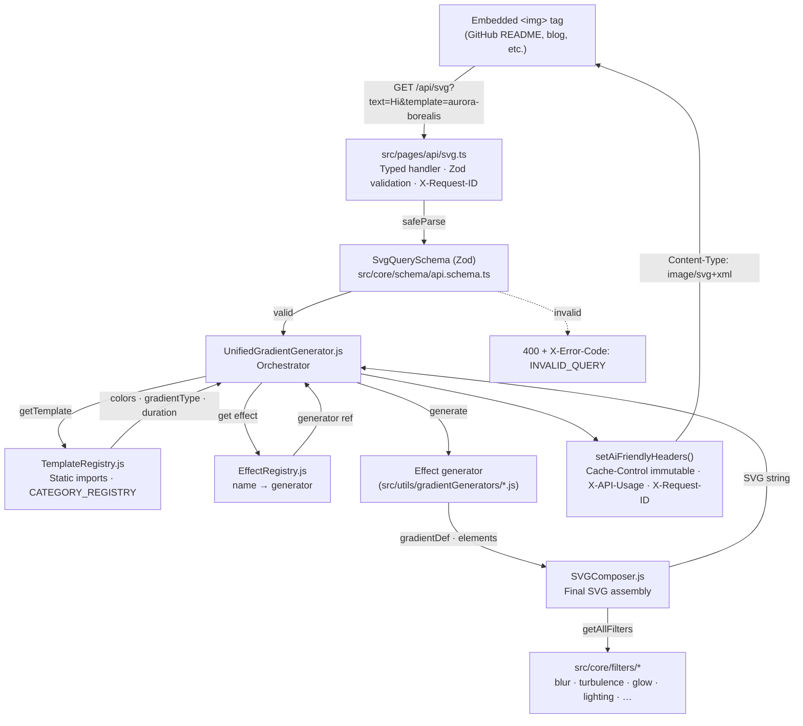
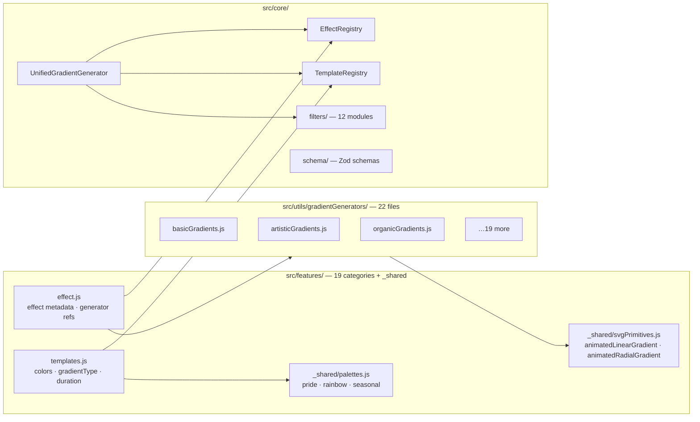
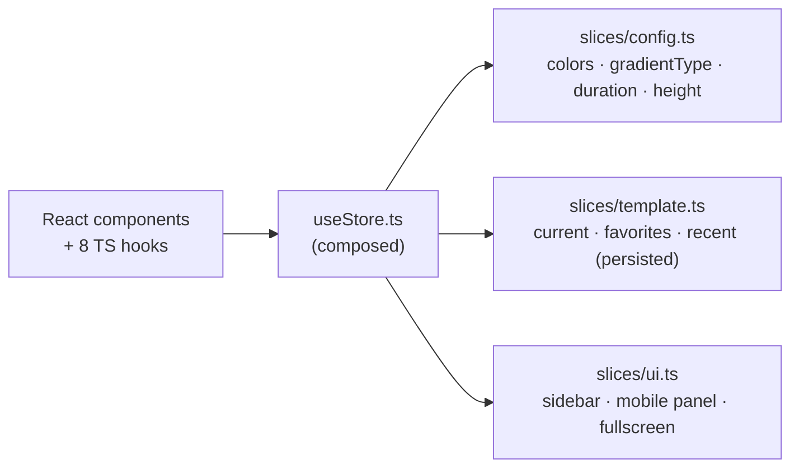
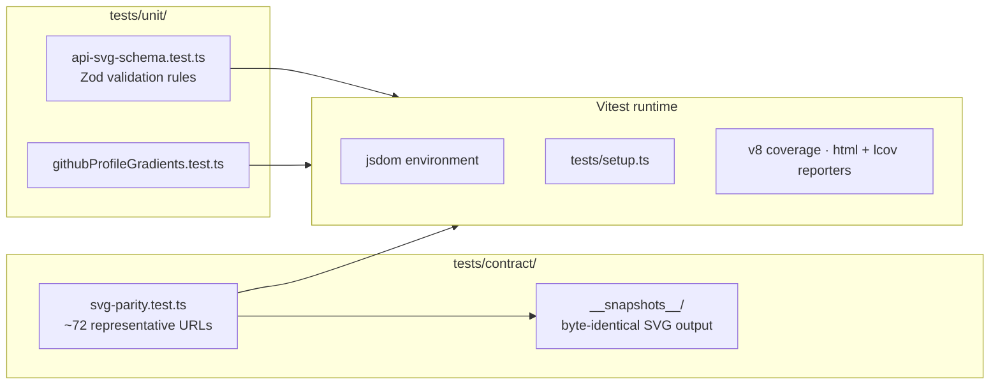

<div align="center"><a name="readme-top"></a>

[](#)

# 🎨 Chromaflow<br/><h3>Professional Dynamic SVG Gradient Creator with 340+ Templates</h3>

The ultimate gradient SVG generator featuring 176 gradient types, 340+ professional templates across 19 categories, and real-time preview.<br/>
Built on Next.js 16 + React 19 with a TypeScript core, Tailwind CSS v4 styling, and Zod-validated APIs — a feature-sliced architecture for infinitely extensible visual effects.<br/>
One-click **FREE** deployment of your stunning gradient banners.

[Live Demo][live-demo] · [Advanced Editor][settings-panel] · [Template Gallery][template-gallery] · [API Documentation][api-docs] · [Architecture][architecture-doc] · [Issues][github-issues-link]

<br/>

[][live-demo]

<br/>

<!-- SHIELD GROUP -->

[![][github-release-shield]][github-release-link]
[![][vercel-shield]][vercel-link]
[![][next-shield]][next-link]
[![][react-shield]][react-link]
[![][typescript-shield]][typescript-link]
[![][tailwind-shield]][tailwind-link]
[![][zod-shield]][zod-link]<br/>
[![][github-contributors-shield]][github-contributors-link]
[![][github-forks-shield]][github-forks-link]
[![][github-stars-shield]][github-stars-link]
[![][github-issues-shield]][github-issues-link]
[![][github-license-shield]][github-license-link]<br>
[![][sponsor-shield]][sponsor-link]

**Share Chromaflow**

[![][share-x-shield]][share-x-link]
[![][share-telegram-shield]][share-telegram-link]
[![][share-whatsapp-shield]][share-whatsapp-link]
[![][share-reddit-shield]][share-reddit-link]
[![][share-linkedin-shield]][share-linkedin-link]

<sup>🌟 Create stunning animated gradient SVGs for your projects. Built for developers, designers, and content creators.</sup>

[![][github-trending-shield]][github-trending-url]

## 🎬 Live Demo Gallery

> [!TIP]
> Experience the power of our gradient generator with these live examples! Click on any code block to copy.

<div align="center">
  
  <p><em>Neural Network Template - AI-inspired gradient with animated effects</em></p>

```markdown

```

</div>

### ✨ Popular Animation Styles

<div align="center">
  <table>
    <tr>
      <td align="center">
        
        <p><strong>Hologram Matrix</strong></p>
        <details>
        <summary>📋 Copy Code</summary>

```markdown

```

        </details>
      </td>
      <td align="center">
        
        <p><strong>Energy Blast</strong></p>
        <details>
        <summary>📋 Copy Code</summary>

```markdown

```

        </details>
      </td>
    </tr>
    <tr>
      <td align="center">
        
        <p><strong>Quantum Field</strong></p>
        <details>
        <summary>📋 Copy Code</summary>

```markdown

```

        </details>
      </td>
      <td align="center">
        
        <p><strong>Diamond Sparkle</strong></p>
        <details>
        <summary>📋 Copy Code</summary>

```markdown

```

        </details>
      </td>
    </tr>

  </table>
</div>

### 🎨 Advanced Gradient Effects

<div align="center">
  <table>
    <tr>
      <td align="center">
        
        <p><strong>Northern Aurora</strong></p>
        <details>
        <summary>📋 Copy Code</summary>

```markdown

```

        </details>
      </td>
      <td align="center">
        
        <p><strong>Lava Flow</strong></p>
        <details>
        <summary>📋 Copy Code</summary>

```markdown

```

        </details>
      </td>
      <td align="center">
        
        <p><strong>Ocean Wave</strong></p>
        <details>
        <summary>📋 Copy Code</summary>

```markdown

```

        </details>
      </td>
    </tr>

  </table>
</div>

<details>
<summary><kbd>🎨 More Demo Examples</kbd></summary>

### 🌈 Diversity & Pride Collection

<div align="center">
  <table>
    <tr>
      <td align="center">
        
        <p><strong>Progress Pride</strong></p>

```markdown

```

      </td>
      <td align="center">
        
        <p><strong>Trans Pride</strong></p>

```markdown

```

      </td>
    </tr>

  </table>
</div>

### 💎 Luxury & Material Effects

<div align="center">
  <table>
    <tr>
      <td align="center">
        
        <p><strong>Golden Leaf</strong></p>

```markdown

```

      </td>
      <td align="center">
        
        <p><strong>Royal Velvet</strong></p>

```markdown

```

      </td>
      <td align="center">
        
        <p><strong>Rose Gold</strong></p>

```markdown

```

      </td>
    </tr>

  </table>
</div>

### 🎮 Gaming & Retro Styles

<div align="center">
  <table>
    <tr>
      <td align="center">
        
        <p><strong>Pixel Art Retro</strong></p>

```markdown

```

      </td>
      <td align="center">
        
        <p><strong>Neon Arcade</strong></p>

```markdown

```

      </td>
      <td align="center">
        
        <p><strong>Retro Wave</strong></p>

```markdown

```

      </td>
    </tr>

  </table>
</div>

### 🔬 Technology & Future

<div align="center">
  <table>
    <tr>
      <td align="center">
        
        <p><strong>Cyber Matrix</strong></p>

```markdown

```

      </td>
      <td align="center">
        
        <p><strong>Data Stream</strong></p>

```markdown

```

      </td>
    </tr>

  </table>
</div>

</details>

**Tech Stack Badges:**

<div align="center">

 
 
 
 
 

</div>

</div>

---

## 🚀 How to Use — 30 Seconds, Zero Install

**1️⃣ Browse** the [Template Showcase](#-template-showcase) below, or open the live **[Template Gallery →](https://gradient-svg-generator.vercel.app/templates)**.
**2️⃣ Click** the copy code next to any animation you like.
**3️⃣ Paste** it into your GitHub README, blog, or any Markdown file. Done. 🎉

```markdown

```

> [!TIP]
> You don't need to install anything, clone any repo, or sign up. Every animation is a single `` URL you embed directly — it renders on GitHub, GitLab, Gitea, blog posts, anywhere Markdown is rendered.

---

## 🎨 Customize Your Own Gradient — No Code Needed

Want different colors? Different text? Different size or speed? **Use our visual editor** — point, click, preview in real time, and copy your custom code.

<div align="center">

### [✨ Open the Visual Editor →](https://gradient-svg-generator.vercel.app/create)

[](https://gradient-svg-generator.vercel.app/create)
[](https://gradient-svg-generator.vercel.app/templates)

</div>

**What the editor lets you change:**

| What                    | How                                                                      |
| ----------------------- | ------------------------------------------------------------------------ |
| 📝 **Text**             | Type anything — your name, a title, an emoji, a quote                    |
| 🎨 **Colors**           | Pick any colors from a palette or paste hex codes                        |
| 📏 **Size**             | Adjust width and height with sliders (any pixel value works)             |
| ⏱️ **Animation speed**  | Slow down or speed up the gradient flow                                  |
| 🌀 **Effect style**     | Swap between 176 gradient types — spiral, hologram, aurora, glitch, more |
| ✨ **Stroke / outline** | Add a text outline in any color and thickness                            |
| 🔄 **Rotation**         | Rotate the text at any angle                                             |

When you're happy with the preview, click **"Copy Markdown"** and paste. It's that simple.

<details>
<summary><kbd>🛠️ Prefer to build the URL by hand?</kbd></summary>

Every option maps to a URL parameter. Mix and match:

```markdown

```

| Parameter       | Example           | What it does                                         |
| --------------- | ----------------- | ---------------------------------------------------- |
| `text=`         | `Your%20Text`     | The text to display (URL-encode spaces as `%20`)     |
| `template=`     | `hologram-matrix` | Pre-made template name (browse the showcase below)   |
| `height=`       | `120`             | Image height in pixels                               |
| `duration=`     | `6s`              | How long one animation loop takes                    |
| `color0=`       | `ff00ff`          | First gradient color (hex, without `#`)              |
| `color1=`       | `00ffff`          | Second color — add `color2`, `color3`, … as you like |
| `gradientType=` | `spiral`          | Override the effect style without using a template   |

Full parameter reference lives inside the [API Reference](#-api-reference) section below.

</details>

---

<details>
<summary><kbd>📑 Table of Contents</kbd></summary>

#### TOC

- [🎨 Chromaflow](#-chromaflow)
  - [🎬 Live Demo Gallery](#-live-demo-gallery) — see it in action
  - [🚀 How to Use](#-how-to-use--30-seconds-zero-install) — 3 steps, zero install
  - [🎨 Customize Your Own Gradient](#-customize-your-own-gradient--no-code-needed) — open the visual editor
  - [🌟 Introduction](#-introduction)
  - [✨ Key Features](#-key-features)
  - [🎨 Template Showcase](#-template-showcase) — **browse 340+ templates**
  - [🔧 API Reference](#-api-reference)
  - [🚀 Getting Started](#-getting-started)
  - [📖 Usage Guide](#-usage-guide)
  - [🤝 Contributing](#-contributing)
  - [📄 License](#-license)
  - Collapsed (click to expand): 🛠️ Tech Stack · 🏗️ Architecture · 🧪 Testing · ⌨️ Development
  - [❤️ Sponsor](#️-sponsor)
  - [📄 License](#-license)
  - [👥 Team](#-team)

####

<br/>

</details>

## 🌟 Introduction

**Chromaflow** is a free tool that generates beautiful, animated gradient SVGs for your GitHub profile, project READMEs, blogs, and social posts — all with a single URL. No installation, no sign-up, no watermarks.

Whether you're a developer, content creator, or designer, pick a template from the showcase below, customize it in the [visual editor](https://gradient-svg-generator.vercel.app/create), and paste the generated code anywhere Markdown is rendered.

> [!NOTE]
>
> - 🎯 **No installation** — just embed an image URL
> - 🎨 **340+ ready-made templates** across 19 styles (Pride, Tech, Nature, Luxury, Gaming, Art, Metallic, and more)
> - ✨ **176 animation effects** — hologram, aurora, spiral, glitch, typing, neon, plasma, and counting
> - 🖼️ **Works everywhere** Markdown is rendered — GitHub, GitLab, Gitea, Bitbucket, blogs, Notion, Obsidian, Docusaurus, VuePress
> - 💰 **Free forever, unlimited use** — no API key, no rate limit, no account
> - ⚡ **Instant CDN delivery** via Vercel Edge Network worldwide

| [![][demo-shield-badge]][live-demo]          | No installation required! Visit our demo to experience it firsthand.      |
| :------------------------------------------- | :------------------------------------------------------------------------ |
| [![][settings-shield-badge]][settings-panel] | Advanced settings panel with full customization options and live preview. |

> [!TIP]
> **⭐ Star us** to receive all release notifications from GitHub without delay!

[![][image-star]][github-stars-link]

<details>
  <summary><kbd>⭐ Star History</kbd></summary>
  <picture>
    <source media="(prefers-color-scheme: dark)" srcset="https://api.star-history.com/svg?repos=ChanMeng666%2Fgradient-svg-generator&theme=dark&type=Date">
    
  </picture>
</details>

## ✨ Key Features

[![][image-feat-core]][live-demo]

### `1` [340+ Professional Templates][template-gallery]

Experience our extensive template library spanning 19 categories. Our innovative template system provides unprecedented variety through carefully curated color palettes and animation effects. This comprehensive collection delivers professional-grade gradients for any project.

<div align="center">
  
  <p><em>Diamond Sparkle Template from our Luxury Collection</em></p>

```markdown

```

</div>

Key template categories include:

- 🌈 **Pride Collection**: 20 LGBTQ+ pride flag templates
- 🔬 **Technology**: AI, neural networks, cyberpunk aesthetics (12 templates)
- 🌿 **Nature**: Sunrise, ocean, forest, aurora effects (13 templates)
- 💎 **Materials & Luxury**: Gold, diamond, marble, crystal textures (19 templates)
- 🎮 **Gaming**: Retro, neon arcade, energy blast effects (8 templates)
- 🎨 **Artistic & Art Movements**: Watercolor, oil paint, impressionism, cubism (35 templates)
- ✨ **Text Effects & Animations**: Glitch, typewriter, luminance (41 templates)
- 🌊 **Organic & Fluid**: Flowing water, flame, liquid dynamics (14 templates)
- 🔮 **Experimental**: Morphing, dimensional, consciousness streams (29 templates)
- ☁️ **Weather & Atmosphere**: Fog, rain, snow, lightning (12 templates)
- 💡 **Light & Shadow**: Caustic, lens flare, god rays, bokeh (12 templates)
- 🍳 **Culinary & Liquid**: Coffee, wine, honey, chocolate (12 templates)
- 🎯 **Patterns**: Candy stripe, zigzag, diamond, hearts (8 templates)
- ✨ **Metallic**: Copper, chrome, bronze, platinum (8 templates)
- 📝 **Path Text**: Typing, curved flow, spiral text (12 templates)
- 🔷 **Shape Backgrounds**: Capsule, egg, blob, wave morphing (37 templates)

> [!TIP]
> You can also combine templates with custom parameters:
>
> ```markdown
> 
> ```

[![][back-to-top]](#readme-top)

### `2` [176 Advanced Gradient Types][api-docs]

Revolutionary gradient system that transforms how users create visual effects. With our advanced algorithms and intuitive API, users can generate professional gradients while maintaining perfect animation performance.

<div align="center">
  <table>
    <tr>
      <td align="center">
        
        <p><strong>Spiral</strong></p>

```markdown

```

      </td>
      <td align="center">
        
        <p><strong>Diamond</strong></p>

```markdown

```

      </td>
      <td align="center">
        
        <p><strong>Wave</strong></p>

```markdown

```

      </td>
      <td align="center">
        
        <p><strong>Burst</strong></p>

```markdown

```

      </td>
    </tr>

  </table>
</div>

**Available Gradient Types:**

- **Basic Types** (7): Linear, Radial, Conic, Diamond, Reflected, Square, Ellipse
- **Text Effects** (5): Luminance, Rainbow, Text Box, Glitch, Typewriter
- **Future Tech** (6): Hologram, Quantum, Laser Grid, Neural Net, Plasma, Data Stream
- **Artistic** (7): Watercolor, Oil Paint, Ink Splash, Mosaic, Abstract Geometry, Graffiti, Vintage
- **Luxury Materials** (7): Gold Foil, Diamond, Marble, Platinum, Rose Gold, Crystal, Velvet
- **Organic Nature** (8): Flowing Water, Flame, Clouds, Aurora, Ocean Waves, Forest, Lightning, Mountain Mist
- **Gaming Effects** (8): Pixel Art, Neon Arcade, Energy Blast, Speed Lines, Boss Battle, Power Up, Cyberpunk, Retro Wave
- **Morphing Effects** (6): Liquid Morphing, Plasma Morphing, Cosmic Morphing, Bio Morphing, Quantum Morphing, Lava Morphing
- **Fluid Dynamics** (6): Turbulent Waves, Electromagnetic Waves, Aurora Waves, Sound Waves, Cryogenic Waves, Solar Waves
- **Dimensional Effects** (6): Portal Distortion, Hypercube Projection, Wormhole Effect, Fractal Dimension, Multiverse Overlap, Reality Distortion
- **Dimensional Portal** (7): Quantum Tunnel, Parallel Dimension, Wormhole Portal, Dimensional Tear, Holographic Grid, Void Distortion, Astral Plane
- **Digital Life** (8): AI Consciousness, Bio-Digital Merge, Quantum DNA, Digital Evolution, Synthetic Soul, Cyber Symbiosis, Neural Storm, Digital Genome
- **Cyber Aesthetics** (9): Neon Cityscape, Data Matrix, Cyberpunk Shadow, Holographic UI, Pixel Corruption, Chrome Finish, Viral Spread, Encryption Field, AR Overlay
- **Consciousness Stream** (9): Thought Waves, Memory Fragments, Dream Logic, Emotional Spectrum, Meditative Calm, Anxiety Spiral, Ego Dissolution, Psychedelic Insight, Collective Unconscious
- **Weather & Atmosphere** (7): Fog Rolling, Monsoon Rain, Snowfall Drift, Sandstorm Swirl, Tornado Vortex, Lightning Web, Prism Refraction
- **Light & Shadow** (7): Caustic Underwater, Venetian Blind, Stained Glass, Lens Flare, Bokeh Blur, God Rays, Eclipse Corona
- **Art Movements** (7): Art Nouveau Flow, Art Deco Luxury, Bauhaus Minimal, Impressionist Dots, Cubist Fragments, Surrealist Melt, Pop Art Halftone
- **Culinary & Liquid** (7): Coffee Cream, Wine Pour, Honey Drizzle, Chocolate Melt, Caramel Swirl, Tie Dye, Marble Mixing
- **Pattern Based** (8): Candy Stripe, Pattern Zigzag, Diamond Pattern, Hearts Pattern, Checkered, Diagonal Flow, Geometric Pulse, Pattern Wave
- **Metallic Effects** (9): Copper Metallic, Shine Shimmer, Neon Pulse, Aqua Flow, Sparkle Effect, Chrome Flow, Bronze Gleam, Platinum Sparkle, Steel Aqua
- **Path Text Animation** (12): Typing Path Reveal, Curved Flow, Spiral Text, Wave Text Path, Char by Char, Word Cascade, Line Sequence, Fade In Path, Handwriting, Brush Stroke, Neon Flicker, Elastic Bounce
- **Blob & Shape Effects** (8): Blob Morph, Liquid Blob, Organic Blob, Layered Waves, Blur Motion, Dreamy Circles, Abstract Blur, Shape Backgrounds (Cylinder, Soft Rounded, Egg Shape, Slice, Speech Bubble, Shark Teeth, Large Rounded)

[![][back-to-top]](#readme-top)

### `*` What Makes Chromaflow Different

- ✨ **Free & unlimited** — no API key, no watermark, no rate limit
- 🎯 **Zero install** — just a URL you embed
- 🎨 **340+ ready-made templates** — or build your own in the editor
- 🖌️ **Unlimited colors** — stack as many gradient stops as you want
- 📱 **Renders everywhere** — GitHub, blogs, Markdown, Notion, anywhere
- ⚡ **Instant** — cached on Vercel Edge for worldwide fast delivery
- 🌐 **Open source** — MIT licensed, self-hostable

<details>
<summary><kbd>🔧 Technical features (for developers)</kbd></summary>

- 🌐 **RESTful API** with Zod-validated query params and `X-Request-ID` headers
- 💎 **Next.js 16 + React 19 + Tailwind CSS v4** (CSS-first `@theme`) with shadcn/ui primitives
- 🗣️ **Multi-Parameter**: Unlimited colors (`color0`, `color1`, …), custom height (1–10000px), stroke, rotation, background
- 🔌 **Feature-Sliced Architecture**: Each category is a vertical slice under `src/features/<name>/` bundling effect, templates, and shared primitives
- 📱 **Mobile-First**: Dedicated mobile UI hooks (`useMobileUI`, `useFullscreenToggle`) with responsive properties panel
- ⚡ **Aggressive Caching**: `Cache-Control: public, max-age=31536000, immutable` — template names are content-addressable
- 💾 **State Management**: Zustand v5 split into 3 slices (config, template, ui) with persistence
- 🧪 **Contract Testing**: Vitest + byte-identical SVG snapshot parity tests (`npm run test:contract`)
- 📦 **Virtualization**: `@tanstack/react-virtual` for the 340+ template gallery
- 🧰 **Scaffolding CLI**: `npm run create:effect` generates a new effect + manifest + template stub
- 🗂️ **PWA Ready**: Service Worker v3 with selective caching (API routes always bypass cache)

</details>

<div align="right">

[![][back-to-top]](#readme-top)

</div>

<details>
<summary><h2 style="display:inline">🛠️ Tech Stack <kbd>click to expand — for developers</kbd></h2></summary>

<div align="center">
  <table>
    <tr>
      <td align="center" width="96">
        
        <br>Next.js 16
      </td>
      <td align="center" width="96">
        
        <br>React 19
      </td>
      <td align="center" width="96">
        
        <br>TypeScript 5.4
      </td>
      <td align="center" width="96">
        
        <br>Tailwind v4
      </td>
      <td align="center" width="96">
        
        <br>Zod 3
      </td>
      <td align="center" width="96">
        
        <br>Vitest
      </td>
      <td align="center" width="96">
        
        <br>Vercel
      </td>
    </tr>
  </table>
</div>

**Frontend Stack:**

- **Framework**: Next.js 16 (Pages Router) with SSR for `/api/svg`
- **UI Library**: React 19 with Hooks and Server Components where available
- **Language**: TypeScript 5.4 (`strict: true`, `allowJs: true` for gradual migration)
- **Styling**: Tailwind CSS v4 (CSS-first `@theme` in `globals.css`) + CSS Modules + shadcn/ui primitives
- **Icons**: Lucide React + React Icons
- **State Management**: Zustand v5 split across 3 slices (`config`, `template`, `ui`) with persistence
- **Animation**: Framer Motion (UI) + native CSS/SVG SMIL (gradient effects)
- **Data / Search**: `@tanstack/react-query`, `@tanstack/react-virtual`, `fuse.js`

**Backend / API Stack:**

- **Runtime**: Node.js 20+ on Next.js API Routes (serverless on Vercel)
- **SVG Engine**: Custom `UnifiedGradientGenerator` → `EffectRegistry` → `SVGComposer` pipeline
- **Validation**: **Zod** schemas at the API boundary (`src/core/schema/api.schema.ts`)
- **Observability**: Per-request `X-Request-ID`, `X-Error-Code` headers, structured console logs
- **Filters**: 12 per-primitive modules under `src/core/filters/` (blur, turbulence, glow, lighting, …)

**Quality & Tooling:**

- **Testing**: Vitest + jsdom + Testing Library + contract snapshot harness
- **Lint / Format**: ESLint 9 (flat config) + typescript-eslint + Prettier
- **Pre-commit**: Husky + lint-staged (`eslint --fix` + `prettier --write`)
- **Scaffolding**: `npm run create:effect` — generates effect + manifest + template stub

**DevOps & Deployment:**

- **Deployment**: [Vercel](https://gradient-svg-generator.vercel.app) (primary) · Docker · any Node 20+ host
- **Performance**: Vercel Edge Network CDN · immutable caching on template outputs
- **PWA**: Service Worker v3 (`public/sw.js`) caches static shell; `/api/*` is never cached

</details>

## 🎨 Template Showcase

> [!TIP]
> **How to use this gallery** — Every template below shows a **live preview on the left** and its **markdown code on the right**. Find one you like, click the code cell to copy, and paste into your own README. Want to change the text or colors? Open the **[Visual Editor →](https://gradient-svg-generator.vercel.app/create)** — any template loads with one click and you can tweak it in real time.

> [!IMPORTANT]
> 340+ professional designs across 19 categories. Each template is carefully crafted with authentic color palettes and optimized animations. All examples work anywhere Markdown is rendered — GitHub, GitLab, blogs, docs sites, Notion, anywhere.

<div align="center">

**Quick jump:** &nbsp;
[🌈 Pride](#-pride-templates-20-templates) · [🔬 Tech](#-technology-templates) · [🌿 Nature](#-nature-templates) · [💎 Material](#-material-templates) · [✨ Text FX](#-text-effect-templates) · [🎮 Gaming](#-gaming-templates) · [☁️ Weather](#️-weather--atmospheric-templates-12-templates) · [💡 Light & Shadow](#-light--shadow-templates-12-templates) · [🎨 Art Movements](#-art-movement-templates-12-templates) · [🍳 Culinary](#-culinary--liquid-flow-templates-12-templates) · [🎯 Patterns](#-pattern-templates-8-templates) · [✨ Metallic](#-metallic-effect-templates-8-templates) · [📝 Path Text](#-path-text-animation-templates-12-templates) · [🔷 Shapes](#-shape-background-templates-25-templates) · [🔮 Experimental](#-experimental-templates-29-templates) · [🏷️ GitHub Profile](#️-github-profile-templates-30-templates)

</div>

### 🌈 Pride Templates (20 Templates)

_Celebrate diversity and inclusion with our comprehensive LGBTQ+ pride collection_

<div align="center">

| Preview                                                                                                                                             | Copy This Code                                                                                                                 |
| --------------------------------------------------------------------------------------------------------------------------------------------------- | ------------------------------------------------------------------------------------------------------------------------------ |
| **Progress Pride**<br/> | `` |
| **Trans Pride**<br/>             | ``          |
| **Bi Pride**<br/>                         | ``                   |
| **Pan Pride**<br/>                     | ``                |

</div>

<details>
<summary><kbd>🏳️‍🌈 View All 20 Pride Templates</kbd></summary>

<div align="center">

| Preview                                                                                                                                                 | Copy This Code                                                                                                                    |
| ------------------------------------------------------------------------------------------------------------------------------------------------------- | --------------------------------------------------------------------------------------------------------------------------------- |
| **Lesbian Pride**<br/>         | ``       |
| **Nonbinary Pride**<br/> | `` |
| **Ace Pride**<br/>                         | ``                   |
| **Genderfluid Pride**<br/> | ``   |
| **Rainbow Pride**<br/>         | ``       |
| **Aromantic Pride**<br/>             | ``             |

</div>

</details>

### 🔬 Technology Templates

_Futuristic and cutting-edge technology-inspired gradients_

<div align="center">

| Preview                                                                                                                                             | Copy This Code                                                                                                                 |
| --------------------------------------------------------------------------------------------------------------------------------------------------- | ------------------------------------------------------------------------------------------------------------------------------ |
| **Neural Network**<br/> | `` |
| **Cyber Matrix**<br/>         | ``       |
| **Quantum Field**<br/>     | ``    |
| **Hologram Blue**<br/>     | ``    |

</div>

### 🌿 Nature Templates

_Natural phenomena with authentic earth-inspired color palettes_

<div align="center">

| Preview                                                                                                                                                 | Copy This Code                                                                                                                    |
| ------------------------------------------------------------------------------------------------------------------------------------------------------- | --------------------------------------------------------------------------------------------------------------------------------- |
| **Sunrise Dawn**<br/>             | ``          |
| **Northern Aurora**<br/> | `` |
| **Ocean Depths**<br/>             | ``          |
| **Forest Mist**<br/>                 | ``             |

</div>

### 💎 Material Templates

_Realistic material textures and luxury finishes_

<div align="center">

| Preview                                                                                                                                                 | Copy This Code                                                                                                                    |
| ------------------------------------------------------------------------------------------------------------------------------------------------------- | --------------------------------------------------------------------------------------------------------------------------------- |
| **Gold Luxury**<br/>                 | ``             |
| **Diamond Crystal**<br/> | `` |
| **Silver Chrome**<br/>         | ``       |
| **Emerald Gem**<br/>                 | ``             |

</div>

### ✨ Text Effect Templates

_Special visual text effects with advanced animations_

<div align="center">

| Preview                                                                                                                                                                 | Copy This Code                                                                                                                                |
| ----------------------------------------------------------------------------------------------------------------------------------------------------------------------- | --------------------------------------------------------------------------------------------------------------------------------------------- |
| **Luminance Glow**<br/>                     | ``                |
| **Rainbow Wave**<br/>                             | ``                      |
| **Glitch Cyber**<br/>                             | ``                      |
| **Typewriter Terminal**<br/> | `` |

</div>

### 🎮 Gaming Templates

_Gaming-inspired retro and modern aesthetics_

<div align="center">

| Preview                                                                                                                                                   | Copy This Code                                                                                                                      |
| --------------------------------------------------------------------------------------------------------------------------------------------------------- | ----------------------------------------------------------------------------------------------------------------------------------- |
| **Pixel Art Retro**<br/> | `` |
| **Neon Arcade**<br/>                   | ``               |
| **Energy Blast**<br/>               | ``            |
| **Cyberpunk City**<br/>       | ``      |

</div>

### ☁️ Weather & Atmospheric Templates (12 Templates)

_Natural weather phenomena and atmospheric visual effects_

<div align="center">

| Preview                                                                                                                                             | Copy This Code                                                                                                                 |
| --------------------------------------------------------------------------------------------------------------------------------------------------- | ------------------------------------------------------------------------------------------------------------------------------ |
| **Fog Rolling**<br/>             | ``          |
| **Monsoon Rain**<br/>         | ``       |
| **Snowfall Drift**<br/> | `` |
| **Lightning Web**<br/>     | ``    |

</div>

### 💡 Light & Shadow Templates (12 Templates)

_Optical effects and illumination patterns_

<div align="center">

| Preview                                                                                                                                                             | Copy This Code                                                                                                                             |
| ------------------------------------------------------------------------------------------------------------------------------------------------------------------- | ------------------------------------------------------------------------------------------------------------------------------------------ |
| **Caustic Underwater**<br/> | `` |
| **Lens Flare**<br/>                                 | ``                         |
| **Bokeh Blur**<br/>                                 | ``                         |
| **God Rays**<br/>                                         | ``                               |

</div>

### 🎨 Art Movement Templates (12 Templates)

_Historical artistic styles and aesthetic movements_

<div align="center">

| Preview                                                                                                                                                             | Copy This Code                                                                                                                             |
| ------------------------------------------------------------------------------------------------------------------------------------------------------------------- | ------------------------------------------------------------------------------------------------------------------------------------------ |
| **Art Nouveau Flow**<br/>       | ``     |
| **Art Deco Luxury**<br/>           | ``        |
| **Impressionist Dots**<br/> | `` |
| **Pop Art Halftone**<br/>       | ``     |

</div>

### 🍳 Culinary & Liquid Flow Templates (12 Templates)

_Food and beverage aesthetics with fluid dynamics_

<div align="center">

| Preview                                                                                                                                             | Copy This Code                                                                                                                 |
| --------------------------------------------------------------------------------------------------------------------------------------------------- | ------------------------------------------------------------------------------------------------------------------------------ |
| **Coffee Cream**<br/>         | ``       |
| **Wine Pour**<br/>                     | ``                |
| **Honey Drizzle**<br/>     | ``    |
| **Chocolate Melt**<br/> | `` |

</div>

### 🎯 Pattern Templates (8 Templates)

_Geometric patterns with dynamic animations_

<div align="center">

| Preview                                                                                                                                                               | Copy This Code                                                                                                                               |
| --------------------------------------------------------------------------------------------------------------------------------------------------------------------- | -------------------------------------------------------------------------------------------------------------------------------------------- |
| **Candy Stripe Dream**<br/> | `` |
| **Zigzag Energy**<br/>                       | ``                  |
| **Diamond Grid**<br/>                           | ``                     |
| **Heart Beat**<br/>                                   | ``                           |

</div>

### ✨ Metallic Effect Templates (8 Templates)

_Metallic and shimmer effects with realistic textures_

<div align="center">

| Preview                                                                                                                                                     | Copy This Code                                                                                                                       |
| ----------------------------------------------------------------------------------------------------------------------------------------------------------- | ------------------------------------------------------------------------------------------------------------------------------------ |
| **Copper Shine**<br/>                 | ``             |
| **Gold Shimmer**<br/>                 | ``             |
| **Chrome Flow**<br/>                     | ``                |
| **Platinum Sparkle**<br/> | `` |

</div>

### 📝 Path Text Animation Templates (12 Templates)

_Advanced text reveal with SVG path animations_

<div align="center">

| Preview                                                                                                                                                               | Copy This Code                                                                                                                               |
| --------------------------------------------------------------------------------------------------------------------------------------------------------------------- | -------------------------------------------------------------------------------------------------------------------------------------------- |
| **Typing Path Reveal**<br/> | `` |
| **Curved Flow**<br/>                               | ``                        |
| **Spiral Text**<br/>                               | ``                        |
| **Neon Flicker**<br/>                           | ``                     |

</div>

### 🔷 Shape Background Templates (25 Templates)

_Capsule-render inspired shape backgrounds with blob morphing and wave effects_

<div align="center">

| Preview                                                                                                                                         | Copy This Code                                                                                                              |
| ----------------------------------------------------------------------------------------------------------------------------------------------- | --------------------------------------------------------------------------------------------------------------------------- |
| **Liquid Venom**<br/>     | ``    |
| **Ocean Depths**<br/>     | ``    |
| **Dreamy Sunset**<br/> | `` |
| **Capsule Tech**<br/>     | ``    |

</div>

### 🔮 Experimental Templates (29 Templates)

<details>
<summary><kbd>View Morphing Effects (6 Templates)</kbd></summary>

_Organic liquid transformations with advanced morphing_

<div align="center">

| Preview                                                                                                                                             | Copy This Code                                                                                                                 |
| --------------------------------------------------------------------------------------------------------------------------------------------------- | ------------------------------------------------------------------------------------------------------------------------------ |
| **Liquid Mercury**<br/> | `` |
| **Plasma Blob**<br/>             | ``          |
| **Quantum Foam**<br/>         | ``       |

</div>

</details>

<details>
<summary><kbd>View Fluid Dynamics (6 Templates)</kbd></summary>

_Advanced fluid simulation and wave propagation effects_

<div align="center">

| Preview                                                                                                                                                                         | Copy This Code                                                                                                                                      |
| ------------------------------------------------------------------------------------------------------------------------------------------------------------------------------- | --------------------------------------------------------------------------------------------------------------------------------------------------- |
| **Turbulent Waves**<br/>                         | ``                   |
| **Electromagnetic Field**<br/> | `` |
| **Aurora Streams**<br/>                             | ``                      |

</div>

</details>

<details>
<summary><kbd>View Dimensional Portal (8 Templates)</kbd></summary>

_Multi-dimensional space distortion and portal effects_

<div align="center">

| Preview                                                                                                                                                     | Copy This Code                                                                                                                       |
| ----------------------------------------------------------------------------------------------------------------------------------------------------------- | ------------------------------------------------------------------------------------------------------------------------------------ |
| **Quantum Tunnel**<br/>         | ``       |
| **Wormhole Transit**<br/> | `` |
| **Dimensional Rift**<br/> | `` |

</div>

</details>

<details>
<summary><kbd>View Consciousness Stream (9 Templates)</kbd></summary>

_Psychological and philosophical visualization of consciousness_

<div align="center">

| Preview                                                                                                                                                     | Copy This Code                                                                                                                       |
| ----------------------------------------------------------------------------------------------------------------------------------------------------------- | ------------------------------------------------------------------------------------------------------------------------------------ |
| **Thought Waves**<br/>             | ``          |
| **Memory Fragments**<br/> | `` |
| **Dream Logic**<br/>                     | ``                |

</div>

</details>

### 🏷️ GitHub Profile Templates (30 Templates)

_Badges, banners, terminals, and cards designed for GitHub profile READMEs — animated SVG effects you can embed anywhere with a single `` tag._

#### Shimmer Badges

Colored status tags with an animated light sweep — perfect for labeling sections, features, or achievements.

<div align="center">

| Preview                                                                                                                 | Markdown Code                                                                                                             |
| ----------------------------------------------------------------------------------------------------------------------- | ------------------------------------------------------------------------------------------------------------------------- |
|  | `` |
|      | ``     |
|             | ``            |
|           | ``          |
|   | ``  |
|                   | ``                  |
|             | ``            |

</div>

> [!TIP]
> Change the badge color by using a custom color parameter: `&color0=your_hex_color` (without `#`). Change the text by editing the `text=` parameter.

#### Terminal Typing

macOS-style terminal window with typing animation and blinking cursor — great for showcasing commands or setup instructions.

<div align="center">

| Preview                                                                                                                                | Markdown Code                                                                                                                      |
| -------------------------------------------------------------------------------------------------------------------------------------- | ---------------------------------------------------------------------------------------------------------------------------------- |
|     | ``     |
|  | `` |
|    | ``  |

</div>

#### Skill Pills

Row of rounded skill/technology pills with shimmer overlay — perfect for showing your tech stack. Use `;` to separate items.

<div align="center">

| Preview                                                                                                                            | Markdown Code                                                                                                                 |
| ---------------------------------------------------------------------------------------------------------------------------------- | ----------------------------------------------------------------------------------------------------------------------------- |
|     | `` |
|  | `` |
|                   | ``               |
|           | ``         |

</div>

> [!TIP]
> Separate skill names with `;` (semicolons) in the `text=` parameter. Add more colors with `&color0=hex&color1=hex` to alternate pill colors.

#### Shimmer Banners

Wide announcement bars with animated shimmer sweep — ideal for project status, CTAs, or featured notices.

<div align="center">

| Preview                                                                                                                                                  | Markdown Code                                                                                                                                         |
| -------------------------------------------------------------------------------------------------------------------------------------------------------- | ----------------------------------------------------------------------------------------------------------------------------------------------------- |
|                  | ``                   |
|                          | ``                         |
|  | `` |
|                        | ``                      |

</div>

#### Shimmer Text

Text with an animated internal gradient highlight — the light passes through the letterforms themselves. Ideal for titles and headings.

<div align="center">

| Preview                                                                                                                                  | Markdown Code                                                                                                                       |
| ---------------------------------------------------------------------------------------------------------------------------------------- | ----------------------------------------------------------------------------------------------------------------------------------- |
|     | ``      |
|     | ``    |
|  | `` |

</div>

#### Gold Badges

Luxury metallic badges with gold gradient, shimmer sweep, and pulsing diamond accents — for highlighting premium features or achievements.

<div align="center">

| Preview                                                                                                                  | Markdown Code                                                                                                          |
| ------------------------------------------------------------------------------------------------------------------------ | ---------------------------------------------------------------------------------------------------------------------- |
|  | ``   |
|   | `` |
|       | ``      |

</div>

#### Social / Achievement Badges

Wide achievement badges with auto-detected light/dark text — for showcasing milestones, trending status, or social proof.

<div align="center">

| Preview                                                                                                                                                  | Markdown Code                                                                                                                                        |
| -------------------------------------------------------------------------------------------------------------------------------------------------------- | ---------------------------------------------------------------------------------------------------------------------------------------------------- |
|  | ``                 |
|    | `` |
|       | ``     |
|         | ``        |

</div>

#### Repo Cards

GitHub-style two-panel cards with icon area, repo name, and shimmer overlay — for linking to your repositories.

<div align="center">

| Preview                                                                                                                   | Markdown Code                                                                                                          |
| ------------------------------------------------------------------------------------------------------------------------- | ---------------------------------------------------------------------------------------------------------------------- |
|  | `` |
|          | ``         |

</div>

<details>
<summary><kbd>🎯 Custom GitHub Profile Effects via API</kbd></summary>

You can also use the `gradientType` parameter directly for full customization:

```markdown
<!-- Custom shimmer badge with any color -->


<!-- Terminal with custom prompt color -->


<!-- Skill pills with custom colors per pill -->


<!-- Shimmer text with base + accent color -->


<!-- Gold badge with custom gold tones -->


<!-- Social badge — auto light/dark text based on background -->


<!-- Repo card with custom panel colors -->


```

</details>

---

## 🔧 API Reference

> **Live endpoint** · [`https://gradient-svg-generator.vercel.app/api/svg`](https://gradient-svg-generator.vercel.app/api/svg)
> **Interactive docs** · [`/api-docs`](https://gradient-svg-generator.vercel.app/api-docs)

### 🌐 Base URL

```
https://gradient-svg-generator.vercel.app/api/svg
```

### 📋 Query Parameters

All parameters are validated at runtime by `SvgQuerySchema` (Zod). Malformed values (e.g. `height=abc`) return **HTTP 400** with `X-Error-Code: INVALID_QUERY` and a JSON body listing the failed fields.

| Parameter               | Type   | Default      | Description                                                        | Example                       |
| ----------------------- | ------ | ------------ | ------------------------------------------------------------------ | ----------------------------- |
| `text`                  | string | _(optional)_ | Display text. Omit to get a safe default SVG                       | `text=Hello%20World`          |
| `height`                | number | `120`        | SVG height in pixels (accepts 1–10000, UI suggests 30–300)         | `height=150`                  |
| `template`              | string | -            | Template name (e.g. `aurora-borealis`, `neural-network`)           | `template=neural-network`     |
| `gradientType`          | string | `horizontal` | Gradient type — implicit default when no template is set           | `gradientType=spiral`         |
| `duration`              | string | `6s`         | Animation duration (CSS time)                                      | `duration=8s`                 |
| `animation`             | string | `none`       | Animation mode                                                     | `animation=pulse`             |
| `stroke`                | string | -            | Text stroke color (hex without `#`)                                | `stroke=ffffff`               |
| `strokeWidth`           | number | `0`          | Text stroke width (parsed with legacy `parseFloat\|\|0` semantics) | `strokeWidth=2`               |
| `textBg`                | string | -            | Background color behind text                                       | `textBg=000000`               |
| `rotate`                | number | `0`          | Rotation in degrees                                                | `rotate=45`                   |
| `color0`, `color1`, ... | string | `000000`     | Gradient colors — collected sequentially until a gap               | `color0=ff0000&color1=00ff00` |

### 📤 Response Headers

Every response — success or failure — carries identifying + observability headers:

| Header               | Value                                                  | Purpose                                |
| -------------------- | ------------------------------------------------------ | -------------------------------------- |
| `Content-Type`       | `image/svg+xml`                                        | SVG MIME type                          |
| `Cache-Control`      | `public, max-age=31536000, immutable`                  | 1-year CDN cache (content-addressable) |
| `X-Request-ID`       | UUID per request                                       | Correlate logs with client reports     |
| `X-API-Usage`        | `free-unlimited-usage`                                 | Policy signal for AI crawlers          |
| `X-Documentation`    | `https://.../api-docs`                                 | Self-describing API                    |
| `X-Template-Gallery` | `https://.../templates`                                | Discovery link                         |
| `X-Creator-Tool`     | `https://.../create`                                   | UI builder link                        |
| `X-Error-Code`       | `INVALID_QUERY` \| `SVG_GENERATION_FAILED` (on errors) | Machine-readable error category        |

### 🎨 Available Gradient Types

<details>
<summary><kbd>📜 Click to expand the full list of 176 gradient types</kbd></summary>

```javascript
// Basic Types (7 types)
('linear', 'radial', 'conic', 'diamond', 'reflected', 'square', 'ellipse');

// Text Effects (5 types)
('luminance', 'rainbow', 'textBox', 'glitch', 'typewriter');

// Future Tech (6 types)
('hologram', 'quantum', 'laserGrid', 'neuralNet', 'plasma', 'dataStream');

// Artistic (7 types)
('watercolor', 'oilPaint', 'inkSplash', 'mosaic', 'abstractGeo', 'graffiti', 'vintage');

// Luxury Materials (7 types)
('goldFoil', 'diamond', 'marble', 'platinum', 'roseGold', 'crystal', 'velvet');

// Organic Nature (8 types)
('flowingWater', 'flame', 'clouds', 'aurora', 'oceanWaves', 'forest', 'lightning', 'mountainMist');

// Gaming Effects (8 types)
('pixelArt',
  'neonArcade',
  'energyBlast',
  'speedLines',
  'bossBattle',
  'powerUp',
  'cyberpunk',
  'retroWave');

// Morphing Effects (6 types)
('liquidMorphing',
  'plasmaMorphing',
  'cosmicMorphing',
  'bioMorphing',
  'quantumMorphing',
  'lavaMorphing');

// Fluid Dynamics (6 types)
('turbulentWaves',
  'electromagneticWaves',
  'auroraWaves',
  'soundWaves',
  'cryogenicWaves',
  'solarWaves');

// Dimensional Effects (6 types)
('portalDistortion',
  'hypercubeProjection',
  'wormholeEffect',
  'fractalDimension',
  'multiverseOverlap',
  'realityDistortion');

// Dimensional Portal (7 types)
('quantumTunnel',
  'parallelDimension',
  'wormholePortal',
  'dimensionalTear',
  'holographicGrid',
  'voidDistortion',
  'astralPlane');

// Digital Life (8 types)
('aiConsciousness',
  'bioDigitalMerge',
  'quantumDNA',
  'digitalEvolution',
  'syntheticSoul',
  'cyberSymbiosis',
  'neuralStorm',
  'digitalGenome');

// Cyber Aesthetics (9 types)
('neonCityscape',
  'dataMatrix',
  'cyberpunkShadow',
  'holographicUI',
  'pixelCorruption',
  'chromeFinish',
  'viralSpread',
  'encryptionField',
  'arOverlay');

// Consciousness Stream (9 types)
('thoughtWaves',
  'memoryFragments',
  'dreamLogic',
  'emotionalSpectrum',
  'meditativeCalm',
  'anxietySpiral',
  'egoDissolution',
  'psychedelicInsight',
  'collectiveUnconscious');

// Weather & Atmosphere (7 types)
('fogRolling',
  'monsoonRain',
  'snowfallDrift',
  'sandstormSwirl',
  'tornadoVortex',
  'lightningWeb',
  'prismRefraction');

// Light & Shadow (7 types)
('causticUnderwater',
  'venetianBlind',
  'stainedGlass',
  'lensFlare',
  'bokehBlur',
  'godRays',
  'eclipseCorona');

// Art Movements (7 types)
('artNouveauFlow',
  'artDecoLuxury',
  'bauhausMinimal',
  'impressionistDots',
  'cubistFragments',
  'surrealistMelt',
  'popArtHalftone');

// Culinary & Liquid (7 types)
('coffeeCream',
  'winePour',
  'honeyDrizzle',
  'chocolateMelt',
  'caramelSwirl',
  'tieDye',
  'marbleMixing');

// Pattern Based (8 types)
('candystripe',
  'patternZigzag',
  'diamondPattern',
  'heartsPattern',
  'checkered',
  'diagonalFlow',
  'geometricPulse',
  'patternWave');

// Metallic Effects (9 types)
('copperMetallic',
  'shineShimmer',
  'neonPulse',
  'aquaFlow',
  'sparkleEffect',
  'chromeFlow',
  'bronzeGleam',
  'platinumSparkle',
  'steelAqua');

// Path Text Animation (12 types)
('typingPathReveal',
  'curvedFlow',
  'spiralText',
  'waveTextPath',
  'charByChar',
  'wordCascade',
  'lineSequence',
  'fadeInPath',
  'handwriting',
  'brushStroke',
  'neonFlicker',
  'elasticBounce');

// Blob & Shape Effects (8 types)
('blobMorph',
  'liquidBlob',
  'organicBlob',
  'layeredWaves',
  'blurMotion',
  'dreamyCircles',
  'abstractBlur');
// Shape Backgrounds (7 types)
('cylinder', 'softRounded', 'eggShape', 'sliceShape', 'speechBubble', 'sharkTeeth', 'largeRounded');

// GitHub Profile Effects (8 types)
('shimmerBadge',
  'terminalTyping',
  'skillPills',
  'shimmerBanner',
  'shimmerText',
  'goldBadge',
  'socialBadge',
  'repoCard');
```

</details>

### 🚀 Usage Examples

#### Basic Usage


```markdown

```

#### Custom Colors


```markdown

```

#### Template with Customization


```markdown

```

#### Advanced Multi-Color


```markdown

```

## 🚀 Getting Started

### 🌐 Use the Live App (Recommended for everyone)

Pick the path that fits what you want to do:

| Goal                                       | Go to                                                                                                  |
| ------------------------------------------ | ------------------------------------------------------------------------------------------------------ |
| 🎨 Build a custom gradient (visual editor) | **[gradient-svg-generator.vercel.app/create](https://gradient-svg-generator.vercel.app/create)**       |
| 🖼️ Browse 340+ ready-made templates        | **[gradient-svg-generator.vercel.app/templates](https://gradient-svg-generator.vercel.app/templates)** |
| 📘 Read the API reference                  | **[gradient-svg-generator.vercel.app/api-docs](https://gradient-svg-generator.vercel.app/api-docs)**   |
| ⚡ Just grab a quick banner                | Copy any snippet from the [Template Showcase](#-template-showcase) above                               |

### 🔗 Direct API Usage (one-liner)


```markdown

```

<details>
<summary><kbd>💻 Local Development & Self-Hosting (for developers)</kbd></summary>

### Prerequisites

- **Node.js 20+** (see `.nvmrc` — pinned engine in `package.json`)
- **npm** (preferred — lockfile is committed) or pnpm/yarn

### Quick Setup

```bash
# Clone repository
git clone https://github.com/ChanMeng666/gradient-svg-generator.git
cd gradient-svg-generator

# Install dependencies (Husky pre-commit hooks auto-install)
npm install

# Start development server
npm run dev
```

🎉 **Success!** Open [http://localhost:3000](http://localhost:3000) to view the application.

### Common Commands

```bash
npm run dev             # Next.js dev server on :3000
npm run build           # Production build
npm start               # Run production build
npm run typecheck       # tsc --noEmit (strict mode)
npm run lint            # ESLint 9 flat config
npm run format          # Prettier write
npm run test            # Full Vitest run
npm run test:watch      # Vitest watch mode
npm run test:contract   # SVG byte-parity snapshot tests (the public-API gate)
npm run create:effect   # Scaffold a new effect + manifest + template stub
```

### Deployment

**Vercel (one-click):**

[](https://vercel.com/new/clone?repository-url=https%3A%2F%2Fgithub.com%2FChanMeng666%2Fgradient-svg-generator)

**Vercel (CLI):**

```bash
npm i -g vercel
vercel --prod
```

**Docker:**

```bash
docker build -t gradient-svg-generator .
docker run -p 3000:3000 gradient-svg-generator
```

**docker-compose.yml:**

```yaml
version: '3.8'
services:
  app:
    build: .
    ports:
      - '3000:3000'
    environment:
      - NODE_ENV=production
```

</details>

## 📖 Usage Guide

### Basic Usage Examples

#### GitHub Profile Headers


```markdown

```

#### Project Banners


```markdown

```

#### Social Media Graphics


```markdown

```

### Advanced Customization

#### Multi-Color Gradients


```markdown

```

#### Custom Animations


```markdown

```

#### Combined Effects


```markdown

```

<details>
<summary><h2 style="display:inline">🏗️ Architecture <kbd>click to expand — for contributors & curious users</kbd></h2></summary>

> [!IMPORTANT]
> The project was recently consolidated into a **feature-sliced architecture** (Phase 5) and migrated to TypeScript at the UI layer (Phase 7). Every refactor is gated by the SVG byte-parity contract test. See [`docs/architecture.md`](./docs/architecture.md) and [`docs/REFACTORING_SUMMARY.md`](./docs/REFACTORING_SUMMARY.md) for the full story.

### Request Lifecycle

The shape of a request is: **validate → resolve template → look up effect → generate → compose → cache**.


```mermaid
flowchart TB
    Client["Embedded &lt;img&gt; tag<br/>(GitHub README, blog, etc.)"]
    API["src/pages/api/svg.ts<br/>Typed handler · Zod validation · X-Request-ID"]
    Schema["SvgQuerySchema (Zod)<br/>src/core/schema/api.schema.ts"]
    UGG["UnifiedGradientGenerator.js<br/>Orchestrator"]
    TR["TemplateRegistry.js<br/>Static imports · CATEGORY_REGISTRY"]
    ER["EffectRegistry.js<br/>name → generator"]
    Gen["Effect generator<br/>(src/utils/gradientGenerators/*.js)"]
    SC["SVGComposer.js<br/>Final SVG assembly"]
    Filters["src/core/filters/*<br/>blur · turbulence · glow · lighting · …"]
    Headers["setAiFriendlyHeaders()<br/>Cache-Control immutable · X-API-Usage · X-Request-ID"]

    Client -->|"GET /api/svg?text=Hi&template=aurora-borealis"| API
    API -->|safeParse| Schema
    Schema -->|valid| UGG
    Schema -.->|invalid| Reject["400 + X-Error-Code: INVALID_QUERY"]
    UGG -->|getTemplate| TR
    TR -->|colors · gradientType · duration| UGG
    UGG -->|get effect| ER
    ER -->|generator ref| UGG
    UGG -->|generate| Gen
    Gen -->|gradientDef · elements| SC
    SC -->|getAllFilters| Filters
    SC -->|SVG string| UGG
    UGG --> Headers
    Headers -->|"Content-Type: image/svg+xml"| Client
```

Every response — success or failure — carries `X-Request-ID`. Successful responses cache for one year (`public, max-age=31536000, immutable`) because the template name is content-addressable.

### Feature-Sliced Architecture

Each gradient category is a **vertical slice** under `src/features/<name>/` bundling the effect manifest, templates, and any shared primitives they depend on:


```mermaid
flowchart LR
    subgraph features["src/features/ — 19 categories + _shared"]
        direction TB
        Manifest["effect.js<br/>effect metadata · generator refs"]
        Templates["templates.js<br/>colors · gradientType · duration"]
        Palettes["_shared/palettes.js<br/>pride · rainbow · seasonal"]
        Primitives["_shared/svgPrimitives.js<br/>animatedLinearGradient · animatedRadialGradient"]
    end

    subgraph generators["src/utils/gradientGenerators/ — 22 files"]
        BasicGen["basicGradients.js"]
        ArtGen["artisticGradients.js"]
        OrgGen["organicGradients.js"]
        OtherGen["…19 more"]
    end

    subgraph core["src/core/"]
        UGG2["UnifiedGradientGenerator"]
        ER2["EffectRegistry"]
        TR2["TemplateRegistry"]
        FL["filters/ — 12 modules"]
        SCH["schema/ — Zod schemas"]
    end

    Manifest --> ER2
    Templates --> TR2
    Templates --> Palettes
    Manifest --> generators
    generators --> Primitives
    UGG2 --> ER2
    UGG2 --> TR2
    UGG2 --> FL
```

Before Phase 5, templates lived in a flat `src/templates/` directory disconnected from their generators. The consolidation merged 22 sub-categories into 19 feature folders and introduced `_shared/palettes.js` + `_shared/svgPrimitives.js` to eliminate copy-paste.

### Project Structure

```
gradient-svg-generator/
├── src/
│   ├── pages/                      # Next.js pages — all .tsx post-Phase 7
│   │   ├── _app.tsx / _document.tsx
│   │   ├── index.tsx               # Home
│   │   ├── create.tsx              # Full editor
│   │   ├── templates.tsx           # Gallery (virtualized)
│   │   ├── api-docs.tsx            # API reference
│   │   └── api/svg.ts              # Typed handler + Zod validation
│   ├── core/                       # SVG engine — legacy JS for parity
│   │   ├── UnifiedGradientGenerator.js   # Main entry
│   │   ├── EffectRegistry.js             # name → generator
│   │   ├── TemplateRegistry.js           # 19 static-imported categories
│   │   ├── SVGComposer.js                # Final assembly
│   │   ├── AnimationLibrary.js
│   │   ├── BaseEffectGenerator.js
│   │   ├── FilterLibrary.js              # 15-line shim → ./filters
│   │   ├── filters/                      # 12 per-primitive modules
│   │   │   ├── blur · turbulence · glow · shadow
│   │   │   ├── colorMatrix · lighting · morphology
│   │   │   ├── convolve · composite
│   │   │   └── presets.js (getAllFilters) · lookups.js · index.js
│   │   ├── schema/                       # Zod schemas (TypeScript)
│   │   │   ├── api.schema.ts             # /api/svg query contract
│   │   │   ├── effect.schema.ts
│   │   │   └── template.schema.ts
│   │   ├── constants.js / registry.js
│   │   └── README.md                     # Module-level docs
│   ├── features/                   # 19 vertical slices + _shared/
│   │   ├── basic · pride · nature · tech · art
│   │   ├── luxury · gaming · material · animation
│   │   ├── fluids · specialty · lightShadow
│   │   ├── pattern · metallic · pathText · shape
│   │   ├── emotion · culinaryLiquid · githubProfile
│   │   ├── _shared/
│   │   │   ├── palettes.js               # Named color palettes
│   │   │   └── svgPrimitives.js          # animatedLinearGradient · animatedRadialGradient
│   │   ├── home/homeData.ts              # Featured/popular lists
│   │   └── index.js                      # Manifest barrel
│   ├── utils/
│   │   ├── gradientGenerators/           # 22 generator files
│   │   ├── colorUtils.js / svgUtils.js / templateUtils.js
│   ├── components/                 # 20 .tsx + 1 .ts (no .jsx)
│   │   ├── layout/                       # Header · Sidebar · Footer
│   │   ├── features/                     # PropertiesPanel (desktop+mobile unified)
│   │   ├── seo/ · ui/                    # shadcn/ui primitives (all .tsx)
│   ├── hooks/                      # 8 hooks, all TypeScript
│   │   └── useColorManagement · useShareActions · usePreviewUrl · …
│   ├── store/                      # Zustand v5 split
│   │   ├── useStore.ts                   # Composed store
│   │   └── slices/{config,template,ui}.ts
│   ├── config/                     # gradientConfig.js (176 types) · colorPalettes.js
│   ├── constants/ · data/          # Category metadata
│   └── styles/                     # globals.css (Tailwind v4 @theme)
├── public/                         # sw.js · manifest.json · icons · llms.txt
├── scripts/create-effect.mjs       # Scaffolding CLI
├── tests/
│   ├── contract/svg-parity.test.ts       # ~72 URL byte-parity snapshots
│   ├── unit/                             # api-svg-schema.test.ts + generators
│   └── setup.ts
└── docs/
    ├── architecture.md                   # Mid-level tour
    ├── adding-an-effect.md               # New-effect walkthrough
    ├── REFACTORING_ARCHITECTURE.md
    └── REFACTORING_SUMMARY.md
```

### Module Responsibilities

| Module                                 | Language | Purpose                                                        |
| -------------------------------------- | -------- | -------------------------------------------------------------- |
| `src/pages/api/svg.ts`                 | TS       | HTTP entry point. Zod validation, error codes, request ID      |
| `src/core/schema/api.schema.ts`        | TS       | Runtime query contract (mirrors legacy coercion rules)         |
| `src/core/UnifiedGradientGenerator`    | JS       | Orchestration between template/effect lookup + composer        |
| `src/core/EffectRegistry`              | JS       | `registerEffect()` / `getEffect()` / category indexing         |
| `src/core/TemplateRegistry`            | JS       | Static imports of all 19 feature template modules              |
| `src/core/SVGComposer`                 | JS       | Assembles SVG string with filters + animations                 |
| `src/core/filters/*`                   | JS       | Per-primitive filter factories (formerly one 604-LOC monolith) |
| `src/utils/gradientGenerators/*`       | JS       | 22 category-scoped gradient generator implementations          |
| `src/features/<category>/effect.js`    | JS       | Feature manifest — declarative effect registration             |
| `src/features/<category>/templates.js` | JS       | Array of template entries `{name, label, colors, …}`           |

### State Management (Zustand v5 slices)


```mermaid
flowchart LR
    useStore["useStore.ts<br/>(composed)"]
    Config["slices/config.ts<br/>colors · gradientType · duration · height"]
    Template["slices/template.ts<br/>current · favorites · recent (persisted)"]
    UIState["slices/ui.ts<br/>sidebar · mobile panel · fullscreen"]
    Components["React components<br/>+ 8 TS hooks"]

    useStore --> Config
    useStore --> Template
    useStore --> UIState
    Components --> useStore
```

### Recent Refactor Timeline

| Phase   | Focus                                                                           |
| ------- | ------------------------------------------------------------------------------- |
| 5.1–5.2 | Bundle 22 flat template files into 19 feature folders (vertical slices)         |
| 5.3     | Extract `_shared/palettes.js` (pride, rainbow, seasonal)                        |
| 5.4     | Factor out `svgPrimitives` (animatedLinear/Radial gradient helpers)             |
| 5.6–5.9 | Split `useStore` into 3 slices; merge desktop+mobile PropertiesPanel            |
| 6.1     | Split 604-LOC `FilterLibrary.js` into 12 per-primitive modules under `filters/` |
| 6.2     | TypeScript `/api/svg`, request IDs, error codes (`X-Error-Code`)                |
| 6.3     | Add `docs/adding-an-effect.md` walkthrough                                      |
| 6.4     | `scripts/create-effect.mjs` scaffolder + README truthing                        |
| 6.6     | Add `docs/architecture.md` capstone                                             |
| 7.1–7.6 | Convert all pages + components + hooks to `.tsx`/`.ts` (strict mode)            |
| 7.3     | Zod template schema with dev-only runtime validation                            |
| 7.7     | Drop orphaned CSS (-191 LOC)                                                    |
| 7.8     | **Zod-validate `/api/svg` query params** + 400 on bad height                    |

</details>

<details>
<summary><h2 style="display:inline">🧪 Testing <kbd>click to expand — for contributors</kbd></h2></summary>

The test strategy has two layers: **unit tests** for generators/schemas and a **contract snapshot harness** that guards the public SVG output.


```mermaid
flowchart LR
    subgraph unit["tests/unit/"]
        U1["api-svg-schema.test.ts<br/>Zod validation rules"]
        U2["githubProfileGradients.test.ts"]
    end

    subgraph contract["tests/contract/"]
        C1["svg-parity.test.ts<br/>~72 representative URLs"]
        C2["__snapshots__/<br/>byte-identical SVG output"]
        C1 --> C2
    end

    subgraph tooling["Vitest runtime"]
        V1["jsdom environment"]
        V2["tests/setup.ts"]
        V3["v8 coverage · html + lcov reporters"]
    end

    U1 --> tooling
    U2 --> tooling
    C1 --> tooling
```

### Contract Tests — the Public-API Gate

`tests/contract/svg-parity.test.ts` hits ~72 representative URLs through the handler, normalizes auto-generated IDs (random DOM IDs, `Date.now()`) to stable markers, and snapshots the resulting SVG. **Any refactor that changes an existing template's byte output fails CI.**

This is the safety net that made every Phase 3–7 refactor possible without user-visible regressions.

```bash
npm run test:contract         # Run the parity gate
npm run test                  # Full Vitest run (unit + contract)
npm run test:watch            # Watch mode
npm run test:ui               # Vitest UI
```

When adding a new effect: additive changes are safe. Refactors that touch shared code must preserve bytes — update snapshots deliberately, never with `--update` as a reflex.

</details>

<details>
<summary><h2 style="display:inline">⌨️ Development <kbd>click to expand — for contributors</kbd></h2></summary>

### Adding a New Template (most common)

Templates live co-located with their generator. Add an entry to the relevant feature folder:

```javascript
// src/features/tech/templates.js
import { palettes } from '../_shared/palettes';

export default [
  // ... existing entries
  {
    name: 'my-awesome-template',
    label: 'My Awesome Template',
    colors: ['ff0080', '7928ca', '0070f3'],
    gradientType: 'hologram',
    animationDuration: '6s',
    description: 'A futuristic gradient with hologram effect',
  },
  // If the sequence is a canonical palette used in 2+ templates:
  // colors: palettes.holographic,
];
```

The template auto-registers via `CATEGORY_REGISTRY` in `src/core/TemplateRegistry.js`.

### Adding a New Effect / Gradient Type

The fastest path is the scaffolding CLI:

```bash
npm run create:effect
# Prompts for category, effect name, and seed template.
# Generates: effect manifest + generator stub + template entry
# Prints a checklist for the three position-indexed registration sites.
```

Manual path:

1. **Generator** — add/extend a file in `src/utils/gradientGenerators/`
2. **Manifest** — register in `src/features/<category>/effect.js`
3. **Config** — add to `GRADIENT_TYPES` in `src/config/gradientConfig.js` (if UI-selectable)
4. **Run** `npm run test:contract` to ensure no existing URLs regress

See [`docs/adding-an-effect.md`](./docs/adding-an-effect.md) for the complete walkthrough.

### Adding a New Feature Category

1. Create `src/features/<name>/effect.js` with a manifest (see `basic/effect.js` for schema)
2. Create `src/features/<name>/templates.js` with initial entries
3. Update the **three position-indexed tables**:
   - `src/core/TemplateRegistry.js` → `CATEGORY_REGISTRY`
   - `src/data/templateCategories.js` → sidebar array
   - `src/utils/templateUtils.js` → `categoryMap`
4. Add to the barrel export in `src/features/index.js`

### Conventional Commits

The project follows Conventional Commits with optional phase tags:

```
feat(phase-7.8): Zod-validate /api/svg query params + 400 on bad height
refactor(phase-7.7): drop orphaned CSS (2 files, -191 LOC)
fix: ...
docs: ...
chore: ...
```

Husky pre-commit hooks run `eslint --fix` and `prettier --write` on staged files via `lint-staged`.

</details>

---

## 🤝 Contributing

We welcome contributions! Here's how you can help improve this project:

### Areas for Contribution

- 🎨 New template designs and color palettes
- ⚡ Additional gradient types and effects
- 🖥️ UI/UX improvements and new features
- 🔧 Performance optimizations
- 📚 Documentation updates and examples
- 🐛 Bug fixes and testing

### Getting Started

1. **Fork** the repository
2. **Create** a feature branch (`git checkout -b feature/amazing-template`)
3. **Make** your changes with proper documentation
4. **Test** thoroughly across different devices
5. **Submit** a pull request with clear description

For major changes, please open an issue first to discuss your ideas.

## 📄 License

This project is licensed under the MIT License - see the [LICENSE](LICENSE) file for details.

**Open Source Benefits:**

- ✅ Commercial use allowed
- ✅ Modification allowed
- ✅ Distribution allowed
- ✅ Private use allowed

## 👥 Team

<div align="center">
  <table>
    <tr>
      <td align="center">
        <a href="https://github.com/ChanMeng666">
          
          <br />
          <sub><b>Chan Meng</b></sub>
        </a>
        <br />
        <small>Creator & Lead Developer</small>
      </td>
    </tr>
  </table>
</div>

## 🙋‍♀️ Author

**Chan Meng**

-  LinkedIn: [chanmeng666](https://www.linkedin.com/in/chanmeng666/)
-  GitHub: [ChanMeng666](https://github.com/ChanMeng666)
-  Email: [chanmeng.dev@gmail.com](mailto:chanmeng.dev@gmail.com)
-  Website: [chanmeng.org](https://chanmeng.org/)

---

<div align="center">
<h3>🌟 Ready to Create Something Amazing? 🌟</h3>
<p>
<a href="https://gradient-svg-generator.vercel.app">🎨 Live App</a> |
<a href="https://gradient-svg-generator.vercel.app/create">⚙️ Advanced Editor</a> |
<a href="https://gradient-svg-generator.vercel.app/templates">🖼️ Template Gallery</a> |
<a href="https://gradient-svg-generator.vercel.app/api-docs">📘 API Docs</a> |
<a href="https://github.com/ChanMeng666/gradient-svg-generator">⭐ Star on GitHub</a> |
<a href="https://github.com/ChanMeng666/gradient-svg-generator/issues">🐛 Report Issues</a>
</p>
<br/>
<p><em>Made with ❤️ by Chan Meng</em></p>
<p><em>Transforming ideas into beautiful gradients, one SVG at a time.</em></p>
</div>

---

<!-- LINK DEFINITIONS -->

[back-to-top]: https://img.shields.io/badge/-BACK_TO_TOP-151515?style=flat-square

<!-- Project Links -->

[live-demo]: https://gradient-svg-generator.vercel.app
[settings-panel]: https://gradient-svg-generator.vercel.app/create
[template-gallery]: https://gradient-svg-generator.vercel.app/templates
[api-docs]: https://gradient-svg-generator.vercel.app/api-docs
[architecture-doc]: ./docs/architecture.md

<!-- GitHub Links -->

[github-issues-link]: https://github.com/ChanMeng666/gradient-svg-generator/issues
[github-stars-link]: https://github.com/ChanMeng666/gradient-svg-generator/stargazers
[github-forks-link]: https://github.com/ChanMeng666/gradient-svg-generator/forks
[github-contributors-link]: https://github.com/ChanMeng666/gradient-svg-generator/contributors
[github-release-link]: https://github.com/ChanMeng666/gradient-svg-generator/releases
[issues-link]: https://github.com/ChanMeng666/gradient-svg-generator/issues
[github-license-link]: https://github.com/ChanMeng666/gradient-svg-generator/blob/main/LICENSE

<!-- Community Links -->

[sponsor-link]: https://github.com/sponsors/ChanMeng666

<!-- Shield Badges -->

[github-release-shield]: https://img.shields.io/github/v/release/ChanMeng666/gradient-svg-generator?color=369eff&labelColor=black&logo=github&style=flat-square
[vercel-shield]: https://img.shields.io/badge/vercel-online-55b467?labelColor=black&logo=vercel&style=flat-square
[next-shield]: https://img.shields.io/badge/next.js-16-000000?labelColor=black&logo=nextdotjs&logoColor=white&style=flat-square
[react-shield]: https://img.shields.io/badge/react-19-61DAFB?labelColor=black&logo=react&logoColor=white&style=flat-square
[typescript-shield]: https://img.shields.io/badge/typescript-5.4-3178C6?labelColor=black&logo=typescript&logoColor=white&style=flat-square
[tailwind-shield]: https://img.shields.io/badge/tailwind-v4-38BDF8?labelColor=black&logo=tailwindcss&logoColor=white&style=flat-square
[zod-shield]: https://img.shields.io/badge/zod-3-3E67B1?labelColor=black&logo=zod&logoColor=white&style=flat-square
[github-contributors-shield]: https://img.shields.io/github/contributors/ChanMeng666/gradient-svg-generator?color=c4f042&labelColor=black&style=flat-square
[github-forks-shield]: https://img.shields.io/github/forks/ChanMeng666/gradient-svg-generator?color=8ae8ff&labelColor=black&style=flat-square
[github-stars-shield]: https://img.shields.io/github/stars/ChanMeng666/gradient-svg-generator?color=ffcb47&labelColor=black&style=flat-square
[github-issues-shield]: https://img.shields.io/github/issues/ChanMeng666/gradient-svg-generator?color=ff80eb&labelColor=black&style=flat-square
[github-license-shield]: https://img.shields.io/badge/license-MIT-white?labelColor=black&style=flat-square
[sponsor-shield]: https://img.shields.io/badge/-Sponsor%20Project-f04f88?logo=github&logoColor=white&style=flat-square
[github-trending-shield]: https://img.shields.io/badge/trending-gradient--svg--generator-ff6b6b?style=flat-square

<!-- Badge Variants -->

[demo-shield-badge]: https://img.shields.io/badge/TRY%20DEMO-ONLINE-55b467?labelColor=black&logo=vercel&style=for-the-badge
[settings-shield-badge]: https://img.shields.io/badge/ADVANCED-EDITOR-369eff?labelColor=black&logo=react&style=for-the-badge

<!-- Social Share Links -->

[share-x-link]: https://x.com/intent/tweet?hashtags=opensource,svg,gradients&text=Check%20out%20this%20amazing%20Gradient%20SVG%20Generator%20with%20340%2B%20templates&url=https%3A%2F%2Fgithub.com%2FChanMeng666%2Fgradient-svg-generator
[share-telegram-link]: https://t.me/share/url?text=Gradient%20SVG%20Generator%20-%20340%2B%20Professional%20Templates&url=https%3A%2F%2Fgithub.com%2FChanMeng666%2Fgradient-svg-generator
[share-whatsapp-link]: https://api.whatsapp.com/send?text=Check%20out%20this%20Gradient%20SVG%20Generator%20https%3A%2F%2Fgithub.com%2FChanMeng666%2Fgradient-svg-generator
[share-reddit-link]: https://www.reddit.com/submit?title=Gradient%20SVG%20Generator%20with%20340%2B%20Professional%20Templates&url=https%3A%2F%2Fgithub.com%2FChanMeng666%2Fgradient-svg-generator
[share-linkedin-link]: https://linkedin.com/sharing/share-offsite/?url=https://github.com/ChanMeng666/gradient-svg-generator
[share-x-shield]: https://img.shields.io/badge/-share%20on%20x-black?labelColor=black&logo=x&logoColor=white&style=flat-square
[share-telegram-shield]: https://img.shields.io/badge/-share%20on%20telegram-black?labelColor=black&logo=telegram&logoColor=white&style=flat-square
[share-whatsapp-shield]: https://img.shields.io/badge/-share%20on%20whatsapp-black?labelColor=black&logo=whatsapp&logoColor=white&style=flat-square
[share-reddit-shield]: https://img.shields.io/badge/-share%20on%20reddit-black?labelColor=black&logo=reddit&logoColor=white&style=flat-square
[share-linkedin-shield]: https://img.shields.io/badge/-share%20on%20linkedin-black?labelColor=black&logo=linkedin&logoColor=white&style=flat-square

<!-- Images -->

[image-star]: https://gradient-svg-generator.vercel.app/api/svg?text=%E2%AD%90%20Star%20Us%20on%20GitHub%20%E2%AD%90&template=golden-leaf&height=200
[image-feat-core]: https://gradient-svg-generator.vercel.app/api/svg?text=Core%20Features&template=diamond-sparkle&height=120

<!-- Trending -->

[github-trending-url]: https://github.com/trending
