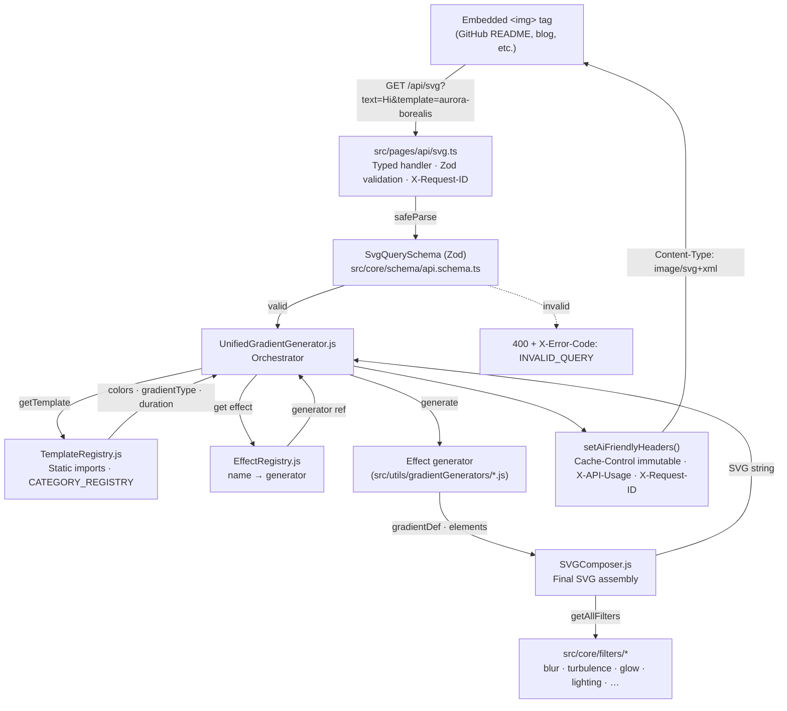
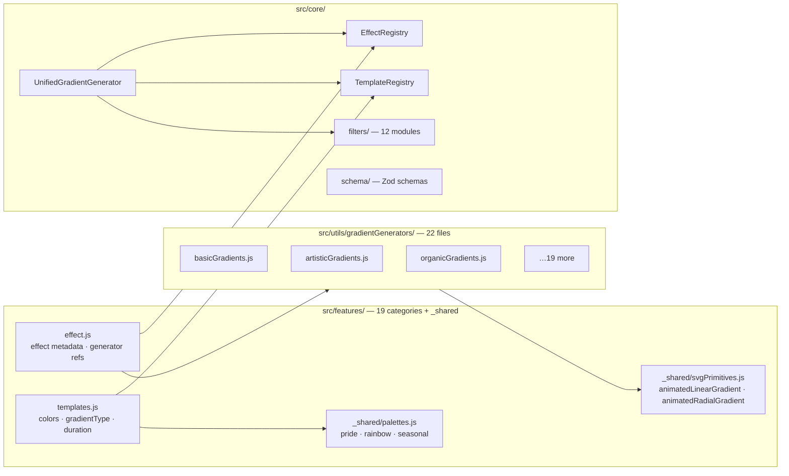
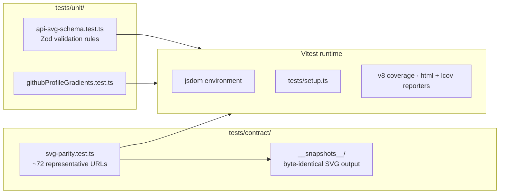

<div align="center"><a name="readme-top"></a>

[](#)

# Gradient SVG Generator

340+ animated gradient SVG banners for your GitHub README — embed a single URL, no install required.

[![][github-release-shield]][github-release-link]
[![][vercel-shield]][vercel-link]
[![][github-stars-shield]][github-stars-link]
[![][github-forks-shield]][github-forks-link]
[![][github-license-shield]][github-license-link]

**[Visual Editor](https://gradient-svg-generator.vercel.app/create)** · **[Template Gallery](https://gradient-svg-generator.vercel.app/templates)** · **[API Docs](https://gradient-svg-generator.vercel.app/api-docs)**

</div>

---

## Table of Contents

- [Quick Start](#quick-start)
- [Template Showcase](#-template-showcase)
  - [🌈 Pride](#-pride-templates-20-templates) · [🔬 Technology](#-technology-templates) · [🌿 Nature](#-nature-templates) · [💎 Material](#-material-templates) · [✨ Text Effects](#-text-effect-templates) · [🎮 Gaming](#-gaming-templates)
  - [☁️ Weather](#️-weather--atmospheric-templates-12-templates) · [💡 Light & Shadow](#-light--shadow-templates-12-templates) · [🎨 Art Movements](#-art-movement-templates-12-templates) · [🍳 Culinary](#-culinary--liquid-flow-templates-12-templates)
  - [🎯 Patterns](#-pattern-templates-8-templates) · [✨ Metallic](#-metallic-effect-templates-8-templates) · [📝 Path Text](#-path-text-animation-templates-12-templates) · [🔷 Shapes](#-shape-background-templates-25-templates)
  - [🔮 Experimental](#-experimental-templates-29-templates) · [🏷️ GitHub Profile](#️-github-profile-templates-30-templates)
- [API Reference](#-api-reference)
- [For Developers](#for-developers)
- [License](#-license)

---

## Quick Start

Paste this into any Markdown file:

```markdown

```

- Replace `Your%20Text` with your own text (spaces → `%20`)
- Replace `neural-network` with any template name from the showcase below
- Works on GitHub, GitLab, Notion, blogs — anywhere Markdown renders

Or open the **[Visual Editor →](https://gradient-svg-generator.vercel.app/create)** to pick colors, size, and animation style interactively, then copy the generated code.

### URL Parameters

| Parameter               | Default      | Description                                                                                  |
| ----------------------- | ------------ | -------------------------------------------------------------------------------------------- |
| `text=`                 | —            | Display text (spaces → `%20`; use `;` to separate multiple items for skill pills)            |
| `template=`             | —            | Template name (from the showcase below)                                                      |
| `height=`               | `120`        | Height in pixels (1–10000)                                                                   |
| `duration=`             | `6s`         | Animation loop duration                                                                      |
| `color0=`, `color1=`, … | `000000`     | Gradient stop colors (hex, no `#`)                                                           |
| `gradientType=`         | `horizontal` | Effect style — overrides the template default; full list in [API Reference](#-api-reference) |
| `stroke=`               | —            | Text stroke color (hex)                                                                      |
| `strokeWidth=`          | `0`          | Text stroke width                                                                            |
| `rotate=`               | `0`          | Text rotation in degrees                                                                     |
| `textBg=`               | —            | Background color behind text (hex)                                                           |

---

## 🎨 Template Showcase

<div align="center">

**Quick jump:** &nbsp;
[🌈 Pride](#-pride-templates-20-templates) · [🔬 Tech](#-technology-templates) · [🌿 Nature](#-nature-templates) · [💎 Material](#-material-templates) · [✨ Text FX](#-text-effect-templates) · [🎮 Gaming](#-gaming-templates) · [☁️ Weather](#️-weather--atmospheric-templates-12-templates) · [💡 Light & Shadow](#-light--shadow-templates-12-templates) · [🎨 Art Movements](#-art-movement-templates-12-templates) · [🍳 Culinary](#-culinary--liquid-flow-templates-12-templates) · [🎯 Patterns](#-pattern-templates-8-templates) · [✨ Metallic](#-metallic-effect-templates-8-templates) · [📝 Path Text](#-path-text-animation-templates-12-templates) · [🔷 Shapes](#-shape-background-templates-25-templates) · [🔮 Experimental](#-experimental-templates-29-templates) · [🏷️ GitHub Profile](#️-github-profile-templates-30-templates)

</div>

### 🌈 Pride Templates (20 Templates)

<div align="center">

| Preview                                                                                                                                             | Copy This Code                                                                                                                 |
| --------------------------------------------------------------------------------------------------------------------------------------------------- | ------------------------------------------------------------------------------------------------------------------------------ |
| **Progress Pride**<br/> | `` |
| **Trans Pride**<br/>             | ``          |
| **Bi Pride**<br/>                         | ``                   |
| **Pan Pride**<br/>                     | ``                |

</div>

<details>
<summary><kbd>🏳️‍🌈 View All 20 Pride Templates</kbd></summary>

<div align="center">

| Preview                                                                                                                                                 | Copy This Code                                                                                                                    |
| ------------------------------------------------------------------------------------------------------------------------------------------------------- | --------------------------------------------------------------------------------------------------------------------------------- |
| **Lesbian Pride**<br/>         | ``       |
| **Nonbinary Pride**<br/> | `` |
| **Ace Pride**<br/>                         | ``                   |
| **Genderfluid Pride**<br/> | ``   |
| **Rainbow Pride**<br/>         | ``       |
| **Aromantic Pride**<br/>             | ``             |

</div>

</details>

### 🔬 Technology Templates

<div align="center">

| Preview                                                                                                                                             | Copy This Code                                                                                                                 |
| --------------------------------------------------------------------------------------------------------------------------------------------------- | ------------------------------------------------------------------------------------------------------------------------------ |
| **Neural Network**<br/> | `` |
| **Cyber Matrix**<br/>         | ``       |
| **Quantum Field**<br/>     | ``    |
| **Hologram Blue**<br/>     | ``    |

</div>

### 🌿 Nature Templates

<div align="center">

| Preview                                                                                                                                                 | Copy This Code                                                                                                                    |
| ------------------------------------------------------------------------------------------------------------------------------------------------------- | --------------------------------------------------------------------------------------------------------------------------------- |
| **Sunrise Dawn**<br/>             | ``          |
| **Northern Aurora**<br/> | `` |
| **Ocean Depths**<br/>             | ``          |
| **Forest Mist**<br/>                 | ``             |

</div>

### 💎 Material Templates

<div align="center">

| Preview                                                                                                                                                 | Copy This Code                                                                                                                    |
| ------------------------------------------------------------------------------------------------------------------------------------------------------- | --------------------------------------------------------------------------------------------------------------------------------- |
| **Gold Luxury**<br/>                 | ``             |
| **Diamond Crystal**<br/> | `` |
| **Silver Chrome**<br/>         | ``       |
| **Emerald Gem**<br/>                 | ``             |

</div>

### ✨ Text Effect Templates

<div align="center">

| Preview                                                                                                                                                                 | Copy This Code                                                                                                                                |
| ----------------------------------------------------------------------------------------------------------------------------------------------------------------------- | --------------------------------------------------------------------------------------------------------------------------------------------- |
| **Luminance Glow**<br/>                     | ``                |
| **Rainbow Wave**<br/>                             | ``                      |
| **Glitch Cyber**<br/>                             | ``                      |
| **Typewriter Terminal**<br/> | `` |

</div>

### 🎮 Gaming Templates

<div align="center">

| Preview                                                                                                                                                   | Copy This Code                                                                                                                      |
| --------------------------------------------------------------------------------------------------------------------------------------------------------- | ----------------------------------------------------------------------------------------------------------------------------------- |
| **Pixel Art Retro**<br/> | `` |
| **Neon Arcade**<br/>                   | ``               |
| **Energy Blast**<br/>               | ``            |
| **Cyberpunk City**<br/>       | ``      |

</div>

### ☁️ Weather & Atmospheric Templates (12 Templates)

<div align="center">

| Preview                                                                                                                                             | Copy This Code                                                                                                                 |
| --------------------------------------------------------------------------------------------------------------------------------------------------- | ------------------------------------------------------------------------------------------------------------------------------ |
| **Fog Rolling**<br/>             | ``          |
| **Monsoon Rain**<br/>         | ``       |
| **Snowfall Drift**<br/> | `` |
| **Lightning Web**<br/>     | ``    |

</div>

### 💡 Light & Shadow Templates (12 Templates)

<div align="center">

| Preview                                                                                                                                                             | Copy This Code                                                                                                                             |
| ------------------------------------------------------------------------------------------------------------------------------------------------------------------- | ------------------------------------------------------------------------------------------------------------------------------------------ |
| **Caustic Underwater**<br/> | `` |
| **Lens Flare**<br/>                                 | ``                         |
| **Bokeh Blur**<br/>                                 | ``                         |
| **God Rays**<br/>                                         | ``                               |

</div>

### 🎨 Art Movement Templates (12 Templates)

<div align="center">

| Preview                                                                                                                                                             | Copy This Code                                                                                                                             |
| ------------------------------------------------------------------------------------------------------------------------------------------------------------------- | ------------------------------------------------------------------------------------------------------------------------------------------ |
| **Art Nouveau Flow**<br/>       | ``     |
| **Art Deco Luxury**<br/>           | ``        |
| **Impressionist Dots**<br/> | `` |
| **Pop Art Halftone**<br/>       | ``     |

</div>

### 🍳 Culinary & Liquid Flow Templates (12 Templates)

<div align="center">

| Preview                                                                                                                                             | Copy This Code                                                                                                                 |
| --------------------------------------------------------------------------------------------------------------------------------------------------- | ------------------------------------------------------------------------------------------------------------------------------ |
| **Coffee Cream**<br/>         | ``       |
| **Wine Pour**<br/>                     | ``                |
| **Honey Drizzle**<br/>     | ``    |
| **Chocolate Melt**<br/> | `` |

</div>

### 🎯 Pattern Templates (8 Templates)

<div align="center">

| Preview                                                                                                                                                               | Copy This Code                                                                                                                               |
| --------------------------------------------------------------------------------------------------------------------------------------------------------------------- | -------------------------------------------------------------------------------------------------------------------------------------------- |
| **Candy Stripe Dream**<br/> | `` |
| **Zigzag Energy**<br/>                       | ``                  |
| **Diamond Grid**<br/>                           | ``                     |
| **Heart Beat**<br/>                                   | ``                           |

</div>

### ✨ Metallic Effect Templates (8 Templates)

<div align="center">

| Preview                                                                                                                                                     | Copy This Code                                                                                                                       |
| ----------------------------------------------------------------------------------------------------------------------------------------------------------- | ------------------------------------------------------------------------------------------------------------------------------------ |
| **Copper Shine**<br/>                 | ``             |
| **Gold Shimmer**<br/>                 | ``             |
| **Chrome Flow**<br/>                     | ``                |
| **Platinum Sparkle**<br/> | `` |

</div>

### 📝 Path Text Animation Templates (12 Templates)

<div align="center">

| Preview                                                                                                                                                               | Copy This Code                                                                                                                               |
| --------------------------------------------------------------------------------------------------------------------------------------------------------------------- | -------------------------------------------------------------------------------------------------------------------------------------------- |
| **Typing Path Reveal**<br/> | `` |
| **Curved Flow**<br/>                               | ``                        |
| **Spiral Text**<br/>                               | ``                        |
| **Neon Flicker**<br/>                           | ``                     |

</div>

### 🔷 Shape Background Templates (25 Templates)

<div align="center">

| Preview                                                                                                                                         | Copy This Code                                                                                                              |
| ----------------------------------------------------------------------------------------------------------------------------------------------- | --------------------------------------------------------------------------------------------------------------------------- |
| **Liquid Venom**<br/>     | ``    |
| **Dreamy Sunset**<br/> | `` |
| **Capsule Tech**<br/>     | ``    |
| **Ocean Depths**<br/>     | ``    |

</div>

### 🔮 Experimental Templates (29 Templates)

<details>
<summary><kbd>View Morphing Effects (6 Templates)</kbd></summary>

<div align="center">

| Preview                                                                                                                                             | Copy This Code                                                                                                                 |
| --------------------------------------------------------------------------------------------------------------------------------------------------- | ------------------------------------------------------------------------------------------------------------------------------ |
| **Liquid Mercury**<br/> | `` |
| **Plasma Blob**<br/>             | ``          |
| **Quantum Foam**<br/>         | ``       |

</div>

</details>

<details>
<summary><kbd>View Fluid Dynamics (6 Templates)</kbd></summary>

<div align="center">

| Preview                                                                                                                                                                         | Copy This Code                                                                                                                                      |
| ------------------------------------------------------------------------------------------------------------------------------------------------------------------------------- | --------------------------------------------------------------------------------------------------------------------------------------------------- |
| **Turbulent Waves**<br/>                         | ``                   |
| **Electromagnetic Field**<br/> | `` |
| **Aurora Streams**<br/>                             | ``                      |

</div>

</details>

<details>
<summary><kbd>View Dimensional Portal (8 Templates)</kbd></summary>

<div align="center">

| Preview                                                                                                                                                     | Copy This Code                                                                                                                       |
| ----------------------------------------------------------------------------------------------------------------------------------------------------------- | ------------------------------------------------------------------------------------------------------------------------------------ |
| **Quantum Tunnel**<br/>         | ``       |
| **Wormhole Transit**<br/> | `` |
| **Dimensional Rift**<br/> | `` |

</div>

</details>

<details>
<summary><kbd>View Consciousness Stream (9 Templates)</kbd></summary>

<div align="center">

| Preview                                                                                                                                                     | Copy This Code                                                                                                                       |
| ----------------------------------------------------------------------------------------------------------------------------------------------------------- | ------------------------------------------------------------------------------------------------------------------------------------ |
| **Thought Waves**<br/>             | ``          |
| **Memory Fragments**<br/> | `` |
| **Dream Logic**<br/>                     | ``                |

</div>

</details>

### 🏷️ GitHub Profile Templates (30 Templates)

#### Shimmer Badges

Colored status tags with an animated light sweep — perfect for labeling sections, features, or achievements.

<div align="center">

| Preview                                                                                                                 | Markdown Code                                                                                                             |
| ----------------------------------------------------------------------------------------------------------------------- | ------------------------------------------------------------------------------------------------------------------------- |
|  | `` |
|      | ``     |
|             | ``            |
|           | ``          |
|   | ``  |
|                   | ``                  |
|             | ``            |

</div>

> Change color: swap the template suffix (`shimmer-red`, `shimmer-green`, `shimmer-blue`, `shimmer-gold`, `shimmer-orange`, `shimmer-purple`, `shimmer-dark`). Change text: edit `text=`.

#### Terminal Typing

macOS-style terminal window with typing animation and blinking cursor.

<div align="center">

| Preview                                                                                                                                | Markdown Code                                                                                                                      |
| -------------------------------------------------------------------------------------------------------------------------------------- | ---------------------------------------------------------------------------------------------------------------------------------- |
|     | ``     |
|  | `` |
|    | ``  |

</div>

#### Skill Pills

Row of rounded skill pills with shimmer overlay. Separate items with `;` in `text=`.

<div align="center">

| Preview                                                                                                                            | Markdown Code                                                                                                                 |
| ---------------------------------------------------------------------------------------------------------------------------------- | ----------------------------------------------------------------------------------------------------------------------------- |
|     | `` |
|  | `` |
|                   | ``               |
|           | ``         |

</div>

#### Shimmer Banners

Wide announcement bars with animated shimmer sweep.

<div align="center">

| Preview                                                                                                                                                  | Markdown Code                                                                                                                                         |
| -------------------------------------------------------------------------------------------------------------------------------------------------------- | ----------------------------------------------------------------------------------------------------------------------------------------------------- |
|                  | ``                   |
|                          | ``                         |
|  | `` |
|                        | ``                      |

</div>

#### Shimmer Text

Text with an animated internal gradient highlight — ideal for titles and headings.

<div align="center">

| Preview                                                                                                                                  | Markdown Code                                                                                                                       |
| ---------------------------------------------------------------------------------------------------------------------------------------- | ----------------------------------------------------------------------------------------------------------------------------------- |
|     | ``      |
|     | ``    |
|  | `` |

</div>

#### Gold Badges

Luxury metallic badges with shimmer sweep and pulsing diamond accents.

<div align="center">

| Preview                                                                                                                  | Markdown Code                                                                                                          |
| ------------------------------------------------------------------------------------------------------------------------ | ---------------------------------------------------------------------------------------------------------------------- |
|  | ``   |
|   | `` |
|       | ``      |

</div>

#### Social / Achievement Badges

Wide achievement badges for showcasing milestones, trending status, or social proof.

<div align="center">

| Preview                                                                                                                                                  | Markdown Code                                                                                                                                        |
| -------------------------------------------------------------------------------------------------------------------------------------------------------- | ---------------------------------------------------------------------------------------------------------------------------------------------------- |
|  | ``                 |
|    | `` |
|       | ``     |
|         | ``        |

</div>

#### Repo Cards

GitHub-style two-panel cards with icon area, repo name, and shimmer overlay.

<div align="center">

| Preview                                                                                                                   | Markdown Code                                                                                                          |
| ------------------------------------------------------------------------------------------------------------------------- | ---------------------------------------------------------------------------------------------------------------------- |
|  | `` |
|          | ``         |

</div>

<details>
<summary><kbd>Custom GitHub Profile Effects via gradientType parameter</kbd></summary>

```markdown
<!-- Shimmer badge with custom color -->


<!-- Terminal with custom prompt color -->


<!-- Skill pills with custom colors per pill -->


<!-- Shimmer text with base + accent color -->


<!-- Gold badge with custom gold tones -->


<!-- Social badge — auto light/dark text based on background -->


<!-- Repo card with custom panel colors -->


```

</details>

---

## 🔧 API Reference

**Endpoint:** `https://gradient-svg-generator.vercel.app/api/svg`  
**Interactive docs:** [/api-docs](https://gradient-svg-generator.vercel.app/api-docs)

### Query Parameters

| Parameter             | Type   | Default      | Description                                    | Example                       |
| --------------------- | ------ | ------------ | ---------------------------------------------- | ----------------------------- |
| `text`                | string | _(optional)_ | Display text                                   | `text=Hello%20World`          |
| `height`              | number | `120`        | SVG height in pixels (1–10000)                 | `height=150`                  |
| `template`            | string | —            | Template name                                  | `template=neural-network`     |
| `gradientType`        | string | `horizontal` | Effect style (default when no template is set) | `gradientType=spiral`         |
| `duration`            | string | `6s`         | Animation duration (CSS time)                  | `duration=8s`                 |
| `animation`           | string | `none`       | Animation mode                                 | `animation=pulse`             |
| `stroke`              | string | —            | Text stroke color (hex without `#`)            | `stroke=ffffff`               |
| `strokeWidth`         | number | `0`          | Text stroke width                              | `strokeWidth=2`               |
| `textBg`              | string | —            | Background color behind text                   | `textBg=000000`               |
| `rotate`              | number | `0`          | Rotation in degrees                            | `rotate=45`                   |
| `color0`, `color1`, … | string | `000000`     | Gradient colors — collected sequentially       | `color0=ff0000&color1=00ff00` |

Malformed values (e.g. `height=abc`) return **HTTP 400** with `X-Error-Code: INVALID_QUERY`.

### Available Gradient Types

<details>
<summary><kbd>Full list of 176 gradientType values</kbd></summary>

```javascript
// Basic Types (7)
('linear', 'radial', 'conic', 'diamond', 'reflected', 'square', 'ellipse');

// Text Effects (5)
('luminance', 'rainbow', 'textBox', 'glitch', 'typewriter');

// Future Tech (6)
('hologram', 'quantum', 'laserGrid', 'neuralNet', 'plasma', 'dataStream');

// Artistic (7)
('watercolor', 'oilPaint', 'inkSplash', 'mosaic', 'abstractGeo', 'graffiti', 'vintage');

// Luxury Materials (7)
('goldFoil', 'diamond', 'marble', 'platinum', 'roseGold', 'crystal', 'velvet');

// Organic Nature (8)
('flowingWater', 'flame', 'clouds', 'aurora', 'oceanWaves', 'forest', 'lightning', 'mountainMist');

// Gaming Effects (8)
('pixelArt',
  'neonArcade',
  'energyBlast',
  'speedLines',
  'bossBattle',
  'powerUp',
  'cyberpunk',
  'retroWave');

// Morphing Effects (6)
('liquidMorphing',
  'plasmaMorphing',
  'cosmicMorphing',
  'bioMorphing',
  'quantumMorphing',
  'lavaMorphing');

// Fluid Dynamics (6)
('turbulentWaves',
  'electromagneticWaves',
  'auroraWaves',
  'soundWaves',
  'cryogenicWaves',
  'solarWaves');

// Dimensional Effects (6)
('portalDistortion',
  'hypercubeProjection',
  'wormholeEffect',
  'fractalDimension',
  'multiverseOverlap',
  'realityDistortion');

// Dimensional Portal (7)
('quantumTunnel',
  'parallelDimension',
  'wormholePortal',
  'dimensionalTear',
  'holographicGrid',
  'voidDistortion',
  'astralPlane');

// Digital Life (8)
('aiConsciousness',
  'bioDigitalMerge',
  'quantumDNA',
  'digitalEvolution',
  'syntheticSoul',
  'cyberSymbiosis',
  'neuralStorm',
  'digitalGenome');

// Cyber Aesthetics (9)
('neonCityscape',
  'dataMatrix',
  'cyberpunkShadow',
  'holographicUI',
  'pixelCorruption',
  'chromeFinish',
  'viralSpread',
  'encryptionField',
  'arOverlay');

// Consciousness Stream (9)
('thoughtWaves',
  'memoryFragments',
  'dreamLogic',
  'emotionalSpectrum',
  'meditativeCalm',
  'anxietySpiral',
  'egoDissolution',
  'psychedelicInsight',
  'collectiveUnconscious');

// Weather & Atmosphere (7)
('fogRolling',
  'monsoonRain',
  'snowfallDrift',
  'sandstormSwirl',
  'tornadoVortex',
  'lightningWeb',
  'prismRefraction');

// Light & Shadow (7)
('causticUnderwater',
  'venetianBlind',
  'stainedGlass',
  'lensFlare',
  'bokehBlur',
  'godRays',
  'eclipseCorona');

// Art Movements (7)
('artNouveauFlow',
  'artDecoLuxury',
  'bauhausMinimal',
  'impressionistDots',
  'cubistFragments',
  'surrealistMelt',
  'popArtHalftone');

// Culinary & Liquid (7)
('coffeeCream',
  'winePour',
  'honeyDrizzle',
  'chocolateMelt',
  'caramelSwirl',
  'tieDye',
  'marbleMixing');

// Pattern Based (8)
('candystripe',
  'patternZigzag',
  'diamondPattern',
  'heartsPattern',
  'checkered',
  'diagonalFlow',
  'geometricPulse',
  'patternWave');

// Metallic Effects (9)
('copperMetallic',
  'shineShimmer',
  'neonPulse',
  'aquaFlow',
  'sparkleEffect',
  'chromeFlow',
  'bronzeGleam',
  'platinumSparkle',
  'steelAqua');

// Path Text Animation (12)
('typingPathReveal',
  'curvedFlow',
  'spiralText',
  'waveTextPath',
  'charByChar',
  'wordCascade',
  'lineSequence',
  'fadeInPath',
  'handwriting',
  'brushStroke',
  'neonFlicker',
  'elasticBounce');

// Blob & Shape Effects (8)
('blobMorph',
  'liquidBlob',
  'organicBlob',
  'layeredWaves',
  'blurMotion',
  'dreamyCircles',
  'abstractBlur');

// Shape Backgrounds (7)
('cylinder', 'softRounded', 'eggShape', 'sliceShape', 'speechBubble', 'sharkTeeth', 'largeRounded');

// GitHub Profile Effects (8)
('shimmerBadge',
  'terminalTyping',
  'skillPills',
  'shimmerBanner',
  'shimmerText',
  'goldBadge',
  'socialBadge',
  'repoCard');
```

</details>

---

## For Developers

<details>
<summary><h3 style="display:inline">💻 Local Development & Self-Hosting</h3></summary>

### Prerequisites

- **Node.js 20+** (see `.nvmrc` — pinned engine in `package.json`)
- **npm** (preferred — lockfile is committed) or pnpm/yarn

### Quick Setup

```bash
git clone https://github.com/ChanMeng666/gradient-svg-generator.git
cd gradient-svg-generator
npm install
npm run dev
```

Open [http://localhost:3000](http://localhost:3000).

### Common Commands

```bash
npm run dev             # Next.js dev server on :3000
npm run build           # Production build
npm start               # Run production build
npm run typecheck       # tsc --noEmit (strict mode)
npm run lint            # ESLint 9 flat config
npm run format          # Prettier write
npm run test            # Full Vitest run
npm run test:watch      # Vitest watch mode
npm run test:contract   # SVG byte-parity snapshot tests (the public-API gate)
npm run create:effect   # Scaffold a new effect + manifest + template stub
```

### Deployment

**Vercel (one-click):**

[](https://vercel.com/new/clone?repository-url=https%3A%2F%2Fgithub.com%2FChanMeng666%2Fgradient-svg-generator)

**Vercel (CLI):**

```bash
npm i -g vercel
vercel --prod
```

**Docker:**

```bash
docker build -t gradient-svg-generator .
docker run -p 3000:3000 gradient-svg-generator
```

</details>

<details>
<summary><h3 style="display:inline">🛠️ Tech Stack</h3></summary>

<div align="center">
  <table>
    <tr>
      <td align="center" width="96">
        
        <br>Next.js 16
      </td>
      <td align="center" width="96">
        
        <br>React 19
      </td>
      <td align="center" width="96">
        
        <br>TypeScript 5.4
      </td>
      <td align="center" width="96">
        
        <br>Tailwind v4
      </td>
      <td align="center" width="96">
        
        <br>Zod 3
      </td>
      <td align="center" width="96">
        
        <br>Vitest
      </td>
      <td align="center" width="96">
        
        <br>Vercel
      </td>
    </tr>
  </table>
</div>

**Frontend Stack:**

- **Framework**: Next.js 16 (Pages Router) with SSR for `/api/svg`
- **UI Library**: React 19 with Hooks and Server Components where available
- **Language**: TypeScript 5.4 (`strict: true`, `allowJs: true` for gradual migration)
- **Styling**: Tailwind CSS v4 (CSS-first `@theme` in `globals.css`) + CSS Modules + shadcn/ui primitives
- **Icons**: Lucide React + React Icons
- **State Management**: Zustand v5 split across 3 slices (`config`, `template`, `ui`) with persistence
- **Animation**: Framer Motion (UI) + native CSS/SVG SMIL (gradient effects)
- **Data / Search**: `@tanstack/react-query`, `@tanstack/react-virtual`, `fuse.js`

**Backend / API Stack:**

- **Runtime**: Node.js 20+ on Next.js API Routes (serverless on Vercel)
- **SVG Engine**: Custom `UnifiedGradientGenerator` → `EffectRegistry` → `SVGComposer` pipeline
- **Validation**: **Zod** schemas at the API boundary (`src/core/schema/api.schema.ts`)
- **Observability**: Per-request `X-Request-ID`, `X-Error-Code` headers, structured console logs
- **Filters**: 12 per-primitive modules under `src/core/filters/` (blur, turbulence, glow, lighting, …)

**Quality & Tooling:**

- **Testing**: Vitest + jsdom + Testing Library + contract snapshot harness
- **Lint / Format**: ESLint 9 (flat config) + typescript-eslint + Prettier
- **Pre-commit**: Husky + lint-staged (`eslint --fix` + `prettier --write`)
- **Scaffolding**: `npm run create:effect` — generates effect + manifest + template stub

**DevOps & Deployment:**

- **Deployment**: [Vercel](https://gradient-svg-generator.vercel.app) (primary) · Docker · any Node 20+ host
- **Performance**: Vercel Edge Network CDN · immutable caching on template outputs
- **PWA**: Service Worker v3 (`public/sw.js`) caches static shell; `/api/*` is never cached

</details>

<details>
<summary><h3 style="display:inline">🏗️ Architecture</h3></summary>

> See [`docs/architecture.md`](./docs/architecture.md) and [`docs/REFACTORING_SUMMARY.md`](./docs/REFACTORING_SUMMARY.md) for the full story.

### Request Lifecycle


```mermaid
flowchart TB
    Client["Embedded &lt;img&gt; tag<br/>(GitHub README, blog, etc.)"]
    API["src/pages/api/svg.ts<br/>Typed handler · Zod validation · X-Request-ID"]
    Schema["SvgQuerySchema (Zod)<br/>src/core/schema/api.schema.ts"]
    UGG["UnifiedGradientGenerator.js<br/>Orchestrator"]
    TR["TemplateRegistry.js<br/>Static imports · CATEGORY_REGISTRY"]
    ER["EffectRegistry.js<br/>name → generator"]
    Gen["Effect generator<br/>(src/utils/gradientGenerators/*.js)"]
    SC["SVGComposer.js<br/>Final SVG assembly"]
    Filters["src/core/filters/*<br/>blur · turbulence · glow · lighting · …"]
    Headers["setAiFriendlyHeaders()<br/>Cache-Control immutable · X-API-Usage · X-Request-ID"]

    Client -->|"GET /api/svg?text=Hi&template=aurora-borealis"| API
    API -->|safeParse| Schema
    Schema -->|valid| UGG
    Schema -.->|invalid| Reject["400 + X-Error-Code: INVALID_QUERY"]
    UGG -->|getTemplate| TR
    TR -->|colors · gradientType · duration| UGG
    UGG -->|get effect| ER
    ER -->|generator ref| UGG
    UGG -->|generate| Gen
    Gen -->|gradientDef · elements| SC
    SC -->|getAllFilters| Filters
    SC -->|SVG string| UGG
    UGG --> Headers
    Headers -->|"Content-Type: image/svg+xml"| Client
```

### Feature-Sliced Architecture

Each gradient category is a **vertical slice** under `src/features/<name>/`:


```mermaid
flowchart LR
    subgraph features["src/features/ — 19 categories + _shared"]
        direction TB
        Manifest["effect.js<br/>effect metadata · generator refs"]
        Templates["templates.js<br/>colors · gradientType · duration"]
        Palettes["_shared/palettes.js<br/>pride · rainbow · seasonal"]
        Primitives["_shared/svgPrimitives.js<br/>animatedLinearGradient · animatedRadialGradient"]
    end

    subgraph generators["src/utils/gradientGenerators/ — 22 files"]
        BasicGen["basicGradients.js"]
        ArtGen["artisticGradients.js"]
        OrgGen["organicGradients.js"]
        OtherGen["…19 more"]
    end

    subgraph core["src/core/"]
        UGG2["UnifiedGradientGenerator"]
        ER2["EffectRegistry"]
        TR2["TemplateRegistry"]
        FL["filters/ — 12 modules"]
        SCH["schema/ — Zod schemas"]
    end

    Manifest --> ER2
    Templates --> TR2
    Templates --> Palettes
    Manifest --> generators
    generators --> Primitives
    UGG2 --> ER2
    UGG2 --> TR2
    UGG2 --> FL
```

### Project Structure

```
gradient-svg-generator/
├── src/
│   ├── pages/                      # Next.js pages — all .tsx post-Phase 7
│   │   ├── _app.tsx / _document.tsx
│   │   ├── index.tsx               # Home
│   │   ├── create.tsx              # Full editor
│   │   ├── templates.tsx           # Gallery (virtualized)
│   │   ├── api-docs.tsx            # API reference
│   │   └── api/svg.ts              # Typed handler + Zod validation
│   ├── core/                       # SVG engine — legacy JS for parity
│   │   ├── UnifiedGradientGenerator.js
│   │   ├── EffectRegistry.js
│   │   ├── TemplateRegistry.js
│   │   ├── SVGComposer.js
│   │   ├── filters/                # 12 per-primitive modules
│   │   └── schema/                 # Zod schemas (TypeScript)
│   ├── features/                   # 19 vertical slices + _shared/
│   │   ├── basic · pride · nature · tech · art
│   │   ├── luxury · gaming · material · animation
│   │   ├── fluids · specialty · lightShadow
│   │   ├── pattern · metallic · pathText · shape
│   │   ├── emotion · culinaryLiquid · githubProfile
│   │   └── _shared/palettes.js · svgPrimitives.js
│   ├── utils/gradientGenerators/   # 22 generator files
│   ├── components/                 # 20 .tsx + 1 .ts
│   ├── hooks/                      # 8 hooks, all TypeScript
│   ├── store/                      # Zustand v5 — 3 slices
│   └── config/                     # gradientConfig.js (176 types)
├── tests/
│   ├── contract/svg-parity.test.ts # ~72 URL byte-parity snapshots
│   └── unit/
└── docs/
    ├── architecture.md
    └── adding-an-effect.md
```

### Module Responsibilities

| Module                                 | Language | Purpose                                                   |
| -------------------------------------- | -------- | --------------------------------------------------------- |
| `src/pages/api/svg.ts`                 | TS       | HTTP entry point. Zod validation, error codes, request ID |
| `src/core/schema/api.schema.ts`        | TS       | Runtime query contract                                    |
| `src/core/UnifiedGradientGenerator`    | JS       | Orchestration between template/effect lookup + composer   |
| `src/core/EffectRegistry`              | JS       | `registerEffect()` / `getEffect()` / category indexing    |
| `src/core/TemplateRegistry`            | JS       | Static imports of all 19 feature template modules         |
| `src/core/SVGComposer`                 | JS       | Assembles SVG string with filters + animations            |
| `src/core/filters/*`                   | JS       | Per-primitive filter factories                            |
| `src/utils/gradientGenerators/*`       | JS       | 22 category-scoped gradient generator implementations     |
| `src/features/<category>/effect.js`    | JS       | Feature manifest — declarative effect registration        |
| `src/features/<category>/templates.js` | JS       | Array of template entries `{name, label, colors, …}`      |

</details>

<details>
<summary><h3 style="display:inline">🧪 Testing</h3></summary>

The test strategy has two layers: **unit tests** for generators/schemas and a **contract snapshot harness** that guards the public SVG output.


```mermaid
flowchart LR
    subgraph unit["tests/unit/"]
        U1["api-svg-schema.test.ts<br/>Zod validation rules"]
        U2["githubProfileGradients.test.ts"]
    end

    subgraph contract["tests/contract/"]
        C1["svg-parity.test.ts<br/>~72 representative URLs"]
        C2["__snapshots__/<br/>byte-identical SVG output"]
        C1 --> C2
    end

    subgraph tooling["Vitest runtime"]
        V1["jsdom environment"]
        V2["tests/setup.ts"]
        V3["v8 coverage · html + lcov reporters"]
    end

    U1 --> tooling
    U2 --> tooling
    C1 --> tooling
```

`tests/contract/svg-parity.test.ts` hits ~72 representative URLs through the handler, normalizes auto-generated IDs to stable markers, and snapshots the resulting SVG. Any refactor that changes an existing template's byte output fails CI.

```bash
npm run test:contract   # Run the parity gate
npm run test            # Full Vitest run (unit + contract)
npm run test:watch      # Watch mode
npm run test:ui         # Vitest UI
```

When adding a new effect: additive changes are safe. Refactors that touch shared code must preserve bytes — update snapshots deliberately, never with `--update` as a reflex.

</details>

<details>
<summary><h3 style="display:inline">⌨️ Development Guide</h3></summary>

### Adding a New Template

Templates live co-located with their generator. Add an entry to the relevant feature folder:

```javascript
// src/features/tech/templates.js
import { palettes } from '../_shared/palettes';

export default [
  // ... existing entries
  {
    name: 'my-awesome-template',
    label: 'My Awesome Template',
    colors: ['ff0080', '7928ca', '0070f3'],
    gradientType: 'hologram',
    animationDuration: '6s',
    description: 'A futuristic gradient with hologram effect',
  },
];
```

The template auto-registers via `CATEGORY_REGISTRY` in `src/core/TemplateRegistry.js`.

### Adding a New Effect / Gradient Type

The fastest path is the scaffolding CLI:

```bash
npm run create:effect
# Prompts for category, effect name, and seed template.
# Generates: effect manifest + generator stub + template entry
```

Manual path:

1. **Generator** — add/extend a file in `src/utils/gradientGenerators/`
2. **Manifest** — register in `src/features/<category>/effect.js`
3. **Config** — add to `GRADIENT_TYPES` in `src/config/gradientConfig.js` (if UI-selectable)
4. **Run** `npm run test:contract` to ensure no existing URLs regress

See [`docs/adding-an-effect.md`](./docs/adding-an-effect.md) for the complete walkthrough.

### Adding a New Feature Category

1. Create `src/features/<name>/effect.js` with a manifest
2. Create `src/features/<name>/templates.js` with initial entries
3. Update the three position-indexed tables:
   - `src/core/TemplateRegistry.js` → `CATEGORY_REGISTRY`
   - `src/data/templateCategories.js` → sidebar array
   - `src/utils/templateUtils.js` → `categoryMap`
4. Add to the barrel export in `src/features/index.js`

### Conventional Commits

```
feat(phase-7.8): Zod-validate /api/svg query params + 400 on bad height
refactor(phase-7.7): drop orphaned CSS (2 files, -191 LOC)
fix: ...
docs: ...
chore: ...
```

Husky pre-commit hooks run `eslint --fix` and `prettier --write` on staged files via `lint-staged`.

### Contributing

1. Fork the repository
2. Create a feature branch (`git checkout -b feature/amazing-template`)
3. Make your changes with proper documentation
4. Run `npm run test:contract` to verify no regressions
5. Submit a pull request with a clear description

For major changes, open an issue first to discuss your ideas.

Areas for contribution: new template designs, additional gradient types, UI/UX improvements, performance optimizations, documentation, bug fixes.

</details>

---

## 📄 License

MIT License — see the [LICENSE](LICENSE) file for details.

**Author:** [Chan Meng](https://github.com/ChanMeng666) · [chanmeng.dev@gmail.com](mailto:chanmeng.dev@gmail.com) · [chanmeng.org](https://chanmeng.org/)

---

<!-- LINK DEFINITIONS -->

[back-to-top]: https://img.shields.io/badge/-BACK_TO_TOP-151515?style=flat-square

<!-- Project Links -->

[live-demo]: https://gradient-svg-generator.vercel.app
[settings-panel]: https://gradient-svg-generator.vercel.app/create
[template-gallery]: https://gradient-svg-generator.vercel.app/templates
[api-docs]: https://gradient-svg-generator.vercel.app/api-docs
[architecture-doc]: ./docs/architecture.md

<!-- GitHub Links -->

[github-issues-link]: https://github.com/ChanMeng666/gradient-svg-generator/issues
[github-stars-link]: https://github.com/ChanMeng666/gradient-svg-generator/stargazers
[github-forks-link]: https://github.com/ChanMeng666/gradient-svg-generator/forks
[github-contributors-link]: https://github.com/ChanMeng666/gradient-svg-generator/contributors
[github-release-link]: https://github.com/ChanMeng666/gradient-svg-generator/releases
[github-license-link]: https://github.com/ChanMeng666/gradient-svg-generator/blob/main/LICENSE

<!-- Shield Badges -->

[github-release-shield]: https://img.shields.io/github/v/release/ChanMeng666/gradient-svg-generator?color=369eff&labelColor=black&logo=github&style=flat-square
[vercel-shield]: https://img.shields.io/badge/vercel-online-55b467?labelColor=black&logo=vercel&style=flat-square
[github-contributors-shield]: https://img.shields.io/github/contributors/ChanMeng666/gradient-svg-generator?color=c4f042&labelColor=black&style=flat-square
[github-forks-shield]: https://img.shields.io/github/forks/ChanMeng666/gradient-svg-generator?color=8ae8ff&labelColor=black&style=flat-square
[github-stars-shield]: https://img.shields.io/github/stars/ChanMeng666/gradient-svg-generator?color=ffcb47&labelColor=black&style=flat-square
[github-issues-shield]: https://img.shields.io/github/issues/ChanMeng666/gradient-svg-generator?color=ff80eb&labelColor=black&style=flat-square
[github-license-shield]: https://img.shields.io/badge/license-MIT-white?labelColor=black&style=flat-square

<!-- Vercel -->

[vercel-link]: https://gradient-svg-generator.vercel.app
