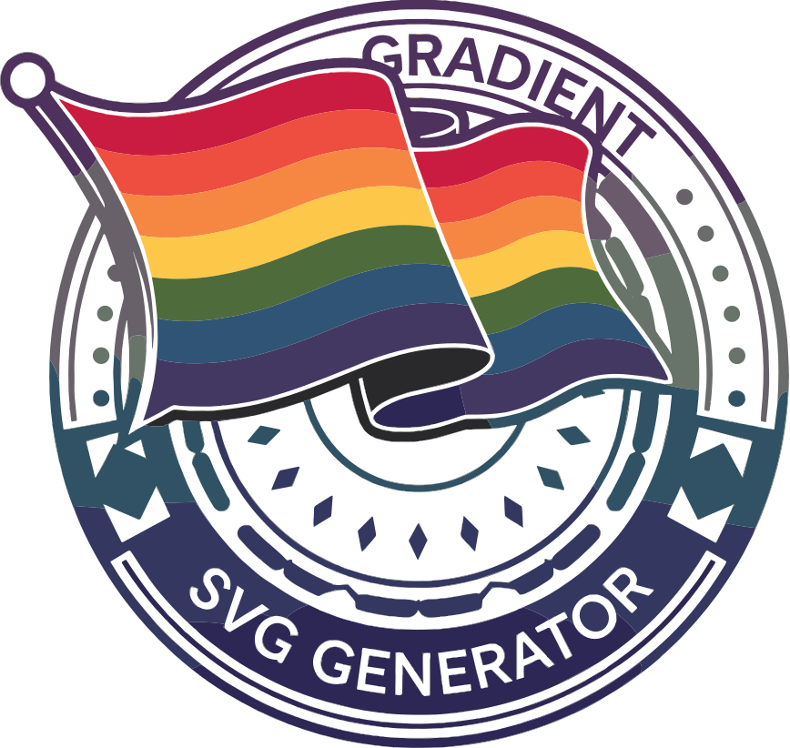

<div align="center">
 <h1><br/>Gradient SVG Generator</h1>
 
 
 
</div>


https://github.com/user-attachments/assets/4a71cdd1-8c48-4038-85fd-2bcb487f9085


## Introduction

The Gradient SVG Generator is a powerful tool that creates animated gradient SVGs with customizable text overlays. Perfect for:
- Creating eye-catching headers for your documentation
- Designing beautiful badges for your GitHub profile
- Generating animated banners for social media
- Adding decorative text elements to your web projects
- Creating inclusive pride-themed graphics

### ✨ Try Our New Settings UI!

Visit our [Settings Page](https://gradient-svg-generator.vercel.app/settings) to customize your gradients with an intuitive user interface! Features include:
- Multiple color selection
- Five gradient types (horizontal, vertical, diagonal, circular, radial)
- Customizable animation duration
- Dark/light mode support
- Live preview
- Easy template selection
- One-click code copying

## 📚 Table of Contents

1. [Quick Start Guide](#quick-start-guide)
2. [Configuration Options](#configuration-options)
3. [Basic Templates Collection](#basic-templates-collection)
4. [Pride Flag Templates](#pride-flag-templates)
5. [Advanced Usage](#advanced-usage)
6. [Installation and Development](#installation-and-development)

## Quick Start Guide

### Using the Settings UI (Recommended)

The easiest way to create your perfect gradient is through our settings UI:

1. Visit [https://gradient-svg-generator.vercel.app/settings](https://gradient-svg-generator.vercel.app/settings)
2. Customize your gradient with our interactive tools
3. Copy the generated markdown code
4. Paste into your README or markdown file

### API Usage

For programmatic usage, you can construct URLs directly:

```markdown

```


## Configuration Options

Query parameters for customization:

| Parameter                | Description              | Default      | Example                       |
| ------------------------ | ------------------------ | ------------ | ----------------------------- |
| `text`                   | Display text (required)  | -            | `text=Hello%20World`          |
| `color0`, `color1`, etc. | Multiple gradient colors | `000000`     | `color0=ff0000&color1=00ff00` |
| `height`                 | SVG height               | `120`        | `height=150`                  |
| `template`               | Gradient template        | -            | `template=sunset-gold`        |
| `gradientType`           | Gradient direction       | `horizontal` | `gradientType=diagonal`       |
| `duration`               | Animation duration       | `6s`         | `duration=8s`                 |

## Basic Templates Collection

Our basic templates showcase various gradient styles with smooth animations:

### Sunset Gold
```markdown

```


### Ocean Heart
```markdown

```


### Emerald Forest
```markdown

```


### Violet Dream
```markdown

```


### Neon City
```markdown

```


### Cyber Punk
```markdown

```


### Northern Lights
```markdown

```


[View more basic templates in the Settings UI](https://gradient-svg-generator.vercel.app/settings)

## Pride Flag Templates

Our pride flag templates accurately represent various pride flags with beautiful gradient animations:

### Progress Pride
```markdown

```


### Trans Pride
```markdown

```


### Bi Pride
```markdown

```


### Pan Pride
```markdown

```


### Nonbinary Pride
```markdown

```


[View more pride templates in the Settings UI](https://gradient-svg-generator.vercel.app/settings)

## Advanced Usage

### Custom Gradients

Create custom gradients with multiple colors and different gradient types:

#### Horizontal Gradient
```markdown

```


#### Diagonal Gradient
```markdown

```


#### Radial Gradient
```markdown

```


For easier customization, use our [Settings UI](https://gradient-svg-generator.vercel.app/settings)!

## Installation and Development

### Prerequisites
- Node.js (version 14.0.0 or higher)
- npm (version 6.0.0 or higher)

### Setup
```bash
# Clone the repository
git clone https://github.com/ChanMeng666/gradient-svg-generator.git

# Install dependencies
cd gradient-svg-generator
npm install

# Start development server
npm run dev
```

## Contributing

Contributions are welcome! Please feel free to submit a Pull Request. For major changes, please open an issue first to discuss what you would like to change.

## License

This project is licensed under the MIT License - see the [LICENSE](LICENSE) file for details.

---

<div align="center">
Made with ❤️ by Chan Meng
<br/>
⭐ Star us on GitHub | 🎨 <a href="https://gradient-svg-generator.vercel.app/settings">Create Your Gradient</a> | 🐛 Report an Issue
</div>
