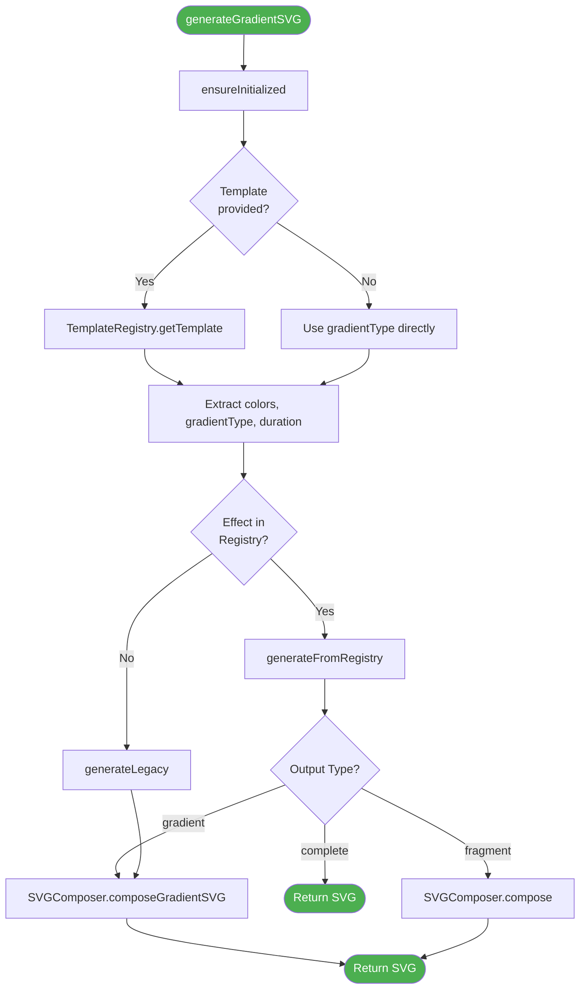

# Gradient SVG Generator - Refactoring Architecture Documentation

## Table of Contents
1. [Overview](#overview)
2. [System Statistics](#system-statistics)
3. [Core Architecture](#core-architecture)
4. [Module Descriptions](#module-descriptions)
5. [SVG Generation Pipeline](#svg-generation-pipeline)
6. [Template System](#template-system)
7. [Service Worker & Caching](#service-worker--caching)
8. [Frontend Architecture](#frontend-architecture)
9. [Backend Architecture](#backend-architecture)
10. [Bug Fixes History](#bug-fixes-history)
11. [Best Practices](#best-practices)
12. [Troubleshooting](#troubleshooting)

---

## Overview

The Gradient SVG Generator project underwent a major refactoring to improve maintainability, scalability, and code organization. The refactoring introduced a new **Effect Registry System** that centralizes effect management and provides a cleaner architecture for SVG generation.

### Architecture Version: 3.0


---

## System Statistics

| Metric | Count | Description |
|--------|-------|-------------|
| Templates | 326+ | Pre-designed gradient templates |
| Categories | 30 | Template categories |
| Gradient Types | 200+ | Unique gradient effects |
| Effect Generators | 21 | Generator modules |
| Core Modules | 7 | Architecture components |

### Effect Categories


---

## Core Architecture

### System Components Diagram


### File Structure

```
src/
├── core/                           # Core architecture modules
│   ├── UnifiedGradientGenerator.js # Main entry point
│   ├── EffectRegistry.js           # Central effect registry
│   ├── EffectLoader.js             # Auto-loads all effects
│   ├── TemplateRegistry.js         # Template loading (static imports)
│   ├── FilterLibrary.js            # SVG filter definitions
│   ├── AnimationLibrary.js         # Animation utilities
│   ├── SVGComposer.js              # SVG document assembly
│   └── README.md                   # Core documentation
├── templates/                      # 30 template category files
│   ├── basicTemplates.js
│   ├── prideTemplates.js
│   ├── natureTemplates.js
│   ├── techTemplates.js
│   ├── artTemplates.js
│   ├── emotionTemplates.js
│   ├── materialTemplates.js
│   ├── luxuryTemplates.js
│   ├── gamingTemplates.js
│   ├── organicTemplates.js
│   ├── weatherTemplates.js
│   ├── lightShadowTemplates.js
│   ├── artMovementTemplates.js
│   ├── patternTemplates.js
│   ├── metallicTemplates.js
│   └── ... (15 more)
├── utils/gradientGenerators/       # 21 effect generator files
│   ├── basicGradients.js
│   ├── shapeGradients.js
│   ├── effectGradients.js
│   ├── futureTechGradients.js
│   ├── artisticGradients.js
│   ├── luxuryGradients.js
│   ├── organicGradients.js
│   ├── gamingGradients.js
│   ├── morphingGradients.js
│   ├── fluidDynamicsGradients.js
│   ├── dimensionalGradients.js
│   ├── weatherGradients.js
│   ├── lightShadowGradients.js
│   ├── artMovementGradients.js
│   ├── culinaryLiquidGradients.js
│   ├── patternGradients.js
│   ├── metallicGradients.js
│   └── ... (4 more)
├── pages/
│   ├── index.js                    # Home page
│   ├── create.js                   # Advanced creation interface
│   ├── templates.js                # Template gallery
│   └── api/svg.js                  # SVG generation API
├── components/
│   ├── layout/                     # Header, Sidebar, Footer
│   ├── features/                   # Feature components
│   └── ui/                         # shadcn/ui components
├── store/
│   └── useStore.js                 # Zustand state management
└── styles/                         # CSS Modules
```

---

## Module Descriptions

### 1. UnifiedGradientGenerator

**Purpose**: Main orchestrator for SVG generation.



### 2. TemplateRegistry

**Purpose**: Manages template loading with **static imports** for Webpack compatibility.

**Key Change**: Replaced dynamic `require()` with static imports to ensure proper bundling.


### 3. EffectRegistry

**Purpose**: Central registry mapping effect names to generators.


### 4. FilterLibrary & AnimationLibrary

**Purpose**: Centralized reusable patterns to reduce code duplication.


---

## SVG Generation Pipeline

### Complete Request Flow


### Template to Effect Mapping

Templates use kebab-case naming, effects use camelCase:

```javascript
const TEMPLATE_MAPPINGS = {
  // Future Tech
  'hologram-matrix': 'hologram',
  'quantum-field': 'quantum',
  'neural-network': 'neuralNet',

  // Artistic
  'watercolor-dream': 'watercolor',
  'oil-painting': 'oilPaint',

  // Organic
  'aurora-borealis': 'aurora',
  'burning-flame': 'flame',
  'ocean-waves': 'oceanWaves',

  // And 100+ more...
};
```

---

## Template System

### Template Structure

```javascript
// Example template definition
module.exports = {
  'aurora-borealis': {
    name: 'aurora-borealis',           // Unique identifier
    label: 'Aurora Borealis',          // Display name
    colors: ['00FF7F', '00CED1', '9370DB', 'FF1493'],  // Hex colors (no #)
    gradientType: 'aurora',            // Maps to effect name
    animationDuration: '6s',           // Animation duration
    description: 'Mesmerizing northern lights'  // Description
  }
};
```

### Category Organization


---

## Service Worker & Caching

### Service Worker v3 Architecture


### Key Points

1. **API routes are NEVER cached** - Ensures fresh SVG responses
2. **Static assets are cached** - Pages, manifest.json
3. **Cache versioning** - `gradient-svg-v3` enables invalidation
4. **Immediate activation** - `skipWaiting()` + `clients.claim()`
5. **Resilient install** - Individual URL caching (not `addAll`)

---

## Frontend Architecture

### Page Structure


### State Management (Zustand)

```javascript
const useStore = create(
  persist(
    (set) => ({
      // Current configuration
      currentConfig: {
        text: 'Hello World',
        colors: ['000000'],
        height: 120,
        gradientType: 'horizontal',
        duration: '6s',
        template: ''
      },

      // User preferences
      favorites: [],
      recentTemplates: [],

      // Actions
      updateConfig: (updates) => set((state) => ({
        currentConfig: { ...state.currentConfig, ...updates }
      })),
      addFavorite: (templateName) => set((state) => ({
        favorites: [...new Set([...state.favorites, templateName])]
      })),
      toggleFavorite: (templateName) => set((state) => ({
        favorites: state.favorites.includes(templateName)
          ? state.favorites.filter(name => name !== templateName)
          : [...new Set([...state.favorites, templateName])]
      }))
    }),
    { name: 'gradient-generator-storage' }
  )
);
```

---

## Bug Fixes History

### Bug #1: Black Gradients Showing (2025-01)

**Symptom**: Templates showing black instead of colors on homepage and /templates page.

**Root Cause**: Service Worker caching `/api/svg` responses. Old broken responses served from cache.

**Fix**:
1. Exclude `/api/*` routes from Service Worker cache
2. Bump cache version to invalidate old caches
3. Add `skipWaiting()` and `clients.claim()` for immediate activation

### Bug #2: Service Worker Install Failure

**Symptom**: `TypeError: Failed to execute 'addAll' on 'Cache'`

**Root Cause**: `favicon.ico` in cache list but file doesn't exist.

**Fix**:
1. Remove non-existent files from `urlsToCache`
2. Use individual `cache.add()` with error handling instead of `addAll()`

### Bug #3: Template Loading in Production

**Symptom**: Templates not loading in production (Webpack bundling issue).

**Root Cause**: Dynamic `require()` calls in TemplateRegistry not bundled by Webpack.

**Fix**: Replace dynamic requires with static imports for all 30 template files.

---

## Best Practices

### Adding New Effects


1. **Create generator** in `src/utils/gradientGenerators/`
2. **Register** in `src/core/EffectLoader.js`
3. **Add type** to `GRADIENT_TYPES` in `gradientConfig.js`
4. **Create template** in appropriate `src/templates/` file
5. **Test** via API and UI

### Testing Checklist

- [ ] Test with various text lengths
- [ ] Test all color combinations
- [ ] Verify animations work smoothly
- [ ] Check SVG validity (well-formed XML)
- [ ] Test API with different parameters
- [ ] **Test in incognito mode** (bypass SW cache)
- [ ] Clear Service Worker if issues persist

---

## Troubleshooting

| Issue | Cause | Solution |
|-------|-------|----------|
| Black gradients | Service Worker cache | Clear site data, unregister SW |
| Template not found | Not in TemplateRegistry | Add static import |
| Effect not found | Not registered | Add to EffectLoader.js |
| Filter not applied | Missing filter ID | Add to FilterLibrary.js |
| Build failure | Dynamic require | Use static imports |

### Clearing Service Worker Cache

```javascript
// In browser console
navigator.serviceWorker.getRegistrations().then(registrations => {
  registrations.forEach(r => r.unregister());
});

// Or via DevTools
// Application > Service Workers > Unregister
// Application > Storage > Clear site data
```

---

**Last Updated**: 2025-01-17
**Architecture Version**: 3.0
**Maintained By**: ChanMeng666
