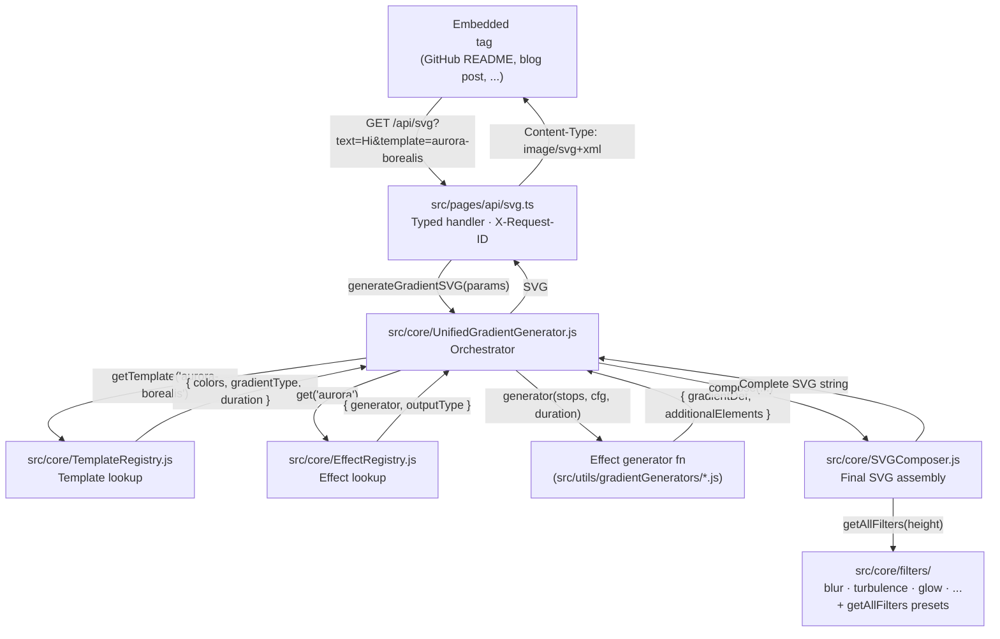
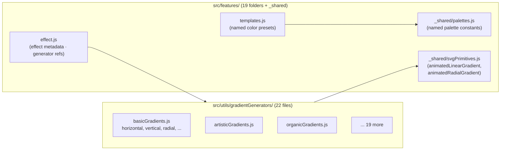
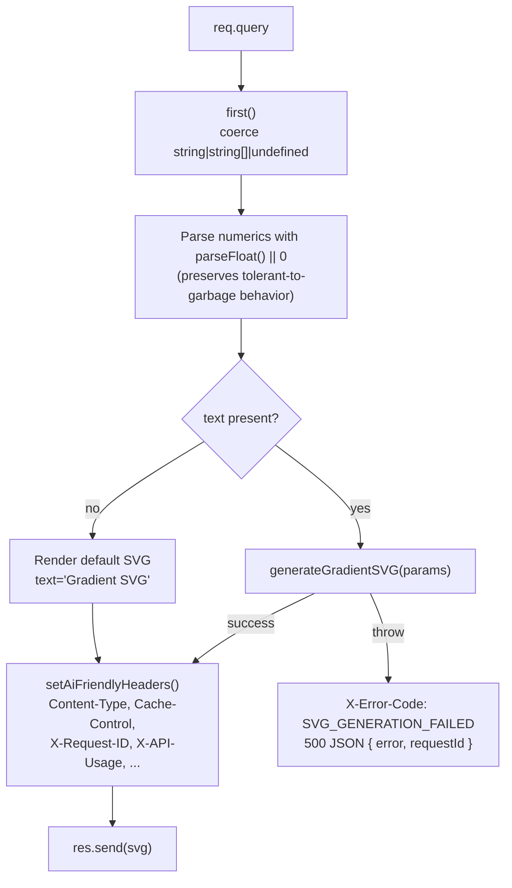

# Architecture

A mid-level tour of how `/api/svg?...` becomes an SVG. Read this once; refer back to it when the registration files (`TemplateRegistry`, `EffectRegistry`) feel confusing.

## The request path



The shape of the trip is: **resolve the template → look up the effect → call the generator → compose the output**. Everything else is plumbing.

## Where data lives



Each feature folder is a vertical slice: the effect manifest, the templates, and the shared primitives they depend on. This is the Phase 5 consolidation — before it, templates lived in `src/templates/` and were disconnected from their generators.

## The three registration sites

When you add a new category, three position-indexed tables need matching entries. They exist for historical compatibility reasons and should eventually collapse into one, but for now:

| File                             | What it registers         | Shape                                                                               |
| -------------------------------- | ------------------------- | ----------------------------------------------------------------------------------- |
| `src/core/TemplateRegistry.js`   | `CATEGORY_REGISTRY`       | `{ basic: { name, icon, templates }, ... }` — order determines collision precedence |
| `src/data/templateCategories.js` | Legacy sidebar array      | `[{ id, name, icon, description, templates }, ...]`                                 |
| `src/utils/templateUtils.js`     | `categoryMap` (two sites) | Array + object — both must match                                                    |
| `src/features/index.js`          | Manifest barrel           | Spread into the registry at load time                                               |

The `scripts/create-effect.mjs` scaffolder prints a checklist for exactly these files.

## Contract and testing

`tests/contract/svg-parity.test.ts` is the public-API gate. It hits ~72 representative URLs through the handler, normalizes auto-generated IDs (random DOM IDs, Date.now values) to stable markers, and snapshots the result.

Every refactor in Phases 3–6 was gated by this test — any change that breaks an existing template's byte output fails CI.

See `docs/adding-an-effect.md` for how this affects new work (additive changes are safe; refactors must preserve bytes).

## Where the 604-LOC FilterLibrary went (Phase 6)

The old monolith was split into one file per filter type:

```
src/core/filters/
├── blur.js              createBlurFilter
├── turbulence.js        createTurbulenceFilter  (the most reused — 40+ call sites)
├── glow.js              createGlowFilter
├── shadow.js            createDropShadowFilter
├── colorMatrix.js       createColorMatrixFilter
├── lighting.js          createSpecularLightingFilter
├── morphology.js        createMorphologyFilter
├── convolve.js          createConvolveFilter
├── composite.js         createCompositeFilter
├── presets.js           getAllFilters — the static 20-filter catalog
├── lookups.js           getFilter, getFilters, getFilterUrl, getFilterForGradientType
└── index.js             barrel re-export
```

`src/core/FilterLibrary.js` is now a 15-line shim that re-exports `./filters`, so the 16+ generators importing from the old path keep working unchanged.

## The /api/svg handler (Phase 6)



Every response (success or failure) carries `X-Request-ID`. Cache-Control is deliberately aggressive (`public, max-age=31536000, immutable`) because templates are content-addressable — the template name uniquely determines the SVG.
