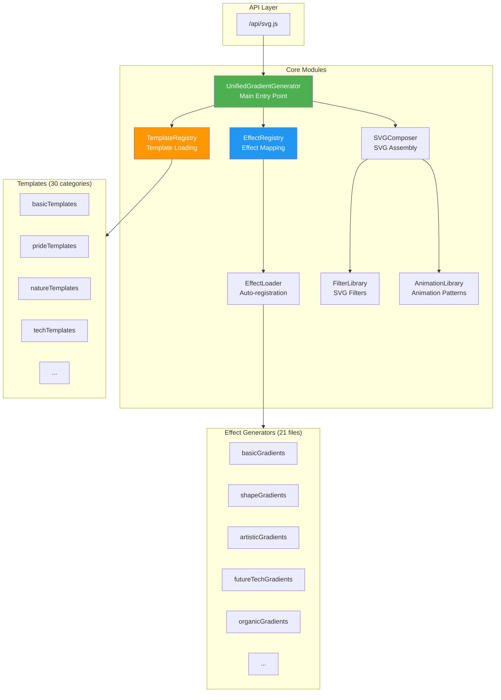
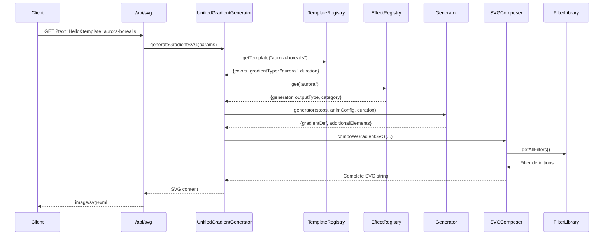
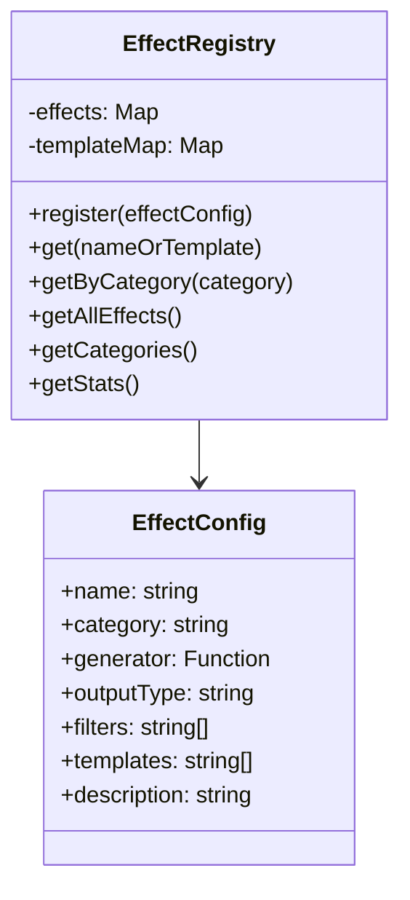
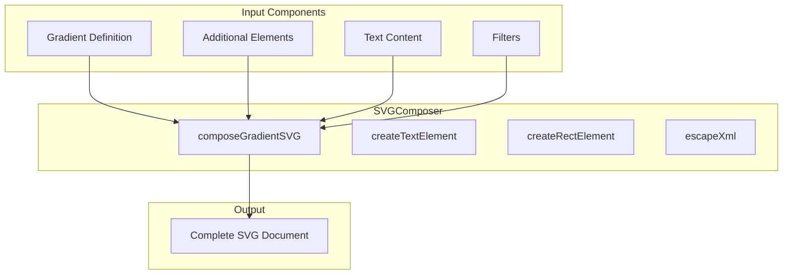
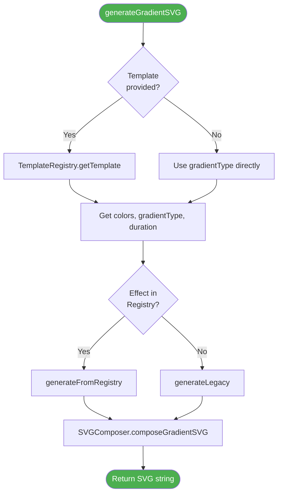
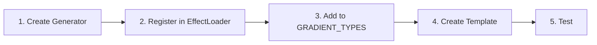

# Core Architecture Documentation

This directory contains the core refactored architecture for the Gradient SVG Generator. The new system provides a unified, extensible, and maintainable approach to SVG effect generation.

## Overview

The refactored architecture consists of seven main components:

1. **Effect Registry** - Central registry for all effects
2. **Effect Loader** - Auto-loads and registers effects
3. **Template Registry** - Manages template loading with static imports
4. **Filter Library** - Centralized SVG filter definitions
5. **Animation Library** - Reusable animation patterns
6. **SVG Composer** - Composes complete SVG documents
7. **Unified Gradient Generator** - Main entry point for generation

## Architecture Diagram



## SVG Generation Flow



## Component Details

### 1. Effect Registry (`EffectRegistry.js`)

**Purpose**: Central registry that maintains all available effects and their metadata.



**Key Features**:
- Maps effect names to generators
- Maps templates to effects
- Stores effect metadata (category, filters, description)
- Provides lookup by name or template
- Category-based organization

**Usage Example**:
```javascript
const { effectRegistry } = require('./EffectRegistry');

// Register an effect
effectRegistry.register({
  name: 'myEffect',
  category: 'custom',
  generator: myGeneratorFunction,
  outputType: 'gradient',
  filters: ['myFilter'],
  description: 'My custom effect',
  templates: ['my-template']
});

// Get effect metadata
const metadata = effectRegistry.get('myEffect');

// Get by template name
const sameMetadata = effectRegistry.get('my-template');
```

### 2. Effect Loader (`EffectLoader.js`)

**Purpose**: Automatically loads all effect generators and registers them in the registry.

**Key Features**:
- Imports all gradient generator modules
- Consolidated template-to-effect mappings (TEMPLATE_MAPPINGS)
- Automatic registration on initialization
- 14+ effect categories loaded

**Effect Categories**:

| Category | Count | Description |
|----------|-------|-------------|
| basic | 9 | Horizontal, vertical, radial, etc. |
| shapes | 7 | Star, heart, wave, lightning |
| futureTech | 6 | Hologram, quantum, neural net |
| artistic | 7 | Watercolor, oil paint, graffiti |
| luxury | 7 | Gold foil, diamond, marble |
| organic | 8 | Aurora, flame, flowing water |
| gaming | 8 | Pixel art, neon arcade, cyberpunk |
| morphing | 6 | Liquid, plasma, cosmic morphing |
| fluidDynamics | 6 | Turbulent waves, aurora waves |
| dimensional | 6 | Portal, wormhole, fractal |
| weather | 7 | Fog, rain, snowfall, tornado |
| lightShadow | 7 | Caustic, lens flare, god rays |
| artMovement | 7 | Art Nouveau, Art Deco, Bauhaus |
| pattern | 8 | Candystripe, zigzag, checkered |

### 3. Template Registry (`TemplateRegistry.js`)

**Purpose**: Manages template loading with static imports for Webpack compatibility.

```mermaid
flowchart LR
    subgraph Static["Static Imports (30 files)"]
        BI[basicTemplates]
        PI[prideTemplates]
        NI[natureTemplates]
        MORE[...]
    end

    subgraph Registry["CATEGORY_REGISTRY"]
        META["Category Metadata<br/>{name, icon, templates}"]
    end

    subgraph Cache["Caching Layer"]
        TC[templateCache]
        CC[categoryTemplatesCache]
    end

    subgraph API["Public API"]
        GT[getTemplate]
        GAT[getAllTemplates]
        GTC[getTemplatesByCategory]
        GC[getCategories]
    end

    Static --> META
    META --> Cache
    Cache --> API
```



**Key Features**:
- **Static imports** instead of dynamic require (Webpack compatible)
- Lazy loading by category
- Template caching for performance
- 30 category files supported

**Usage Example**:
```javascript
const TemplateRegistry = require('./TemplateRegistry');

// Get specific template
const template = TemplateRegistry.getTemplate('aurora-borealis');
// Returns: { name, label, colors, gradientType, animationDuration, description }

// Get templates by category
const techTemplates = TemplateRegistry.getTemplatesByCategory('tech');

// Get all categories
const categories = TemplateRegistry.getCategories();
// Returns: [{ id, name, icon }, ...]
```

### 4. Filter Library (`FilterLibrary.js`)

**Purpose**: Centralized repository of all SVG filter definitions.

**Available Filters**:
- `softLight` - Soft light effect
- `smoothTransition` - Smooth transitions
- `radialBlur` - Radial blur
- `energyEffect` - Energy and turbulence
- `spiralEffect` - Spiral distortion
- `waveEffect` - Wave motion
- `crystalEffect` - Crystal specular lighting
- `starEffect` - Star glow
- `galaxyEffect` - Galaxy turbulence
- `glitchEffect` - RGB glitch
- `typewriterEffect` - Typewriter shadow
- And many more...

**Parameterized Filter Generators**:
```javascript
const {
  createTurbulenceFilter,
  createBlurFilter,
  createColorMatrixFilter
} = require('./FilterLibrary');

// Create custom turbulence filter
const filter = createTurbulenceFilter('myFilter', {
  baseFrequency: '0.5',
  numOctaves: 3,
  scale: 15,
  animated: true,
  animationValues: '15;25;15',
  duration: '6s'
});
```

### 5. Animation Library (`AnimationLibrary.js`)

**Purpose**: Centralized animation patterns and utilities.

**Key Features**:
- Reusable animation configurations
- Duration multiplier utilities
- Standard animation presets

**Usage Example**:
```javascript
const { buildAnimationConfig, multiplyDuration } = require('./AnimationLibrary');

// Build animation config
const animConfig = buildAnimationConfig('6s');
// Returns: 'dur="6s" repeatCount="indefinite"'

// Multiply duration
const slowerDuration = multiplyDuration('6s', 1.5);
// Returns: '9s'
```

### 6. SVG Composer (`SVGComposer.js`)

**Purpose**: Handles composition of complete SVG documents from components.



**Usage Example**:
```javascript
const { svgComposer } = require('./SVGComposer');

// Compose gradient SVG
const svg = svgComposer.composeGradientSVG({
  text: 'Hello World',
  gradientDef: '<linearGradient id="gradient">...</linearGradient>',
  additionalElements: '<filter>...</filter>',
  clipPath: '',
  gradientType: 'horizontal',
  width: 854,
  height: 120
});
```

### 7. Unified Gradient Generator (`UnifiedGradientGenerator.js`)

**Purpose**: Main entry point that orchestrates the entire SVG generation process.



**Usage Example**:
```javascript
const { generateGradientSVG, getSystemStats } = require('./UnifiedGradientGenerator');

// Generate with template
const svg = generateGradientSVG({
  text: 'Hello World',
  template: 'aurora-borealis'
});

// Generate with gradient type
const svg2 = generateGradientSVG({
  text: 'Custom',
  colors: ['ff0000', '00ff00', '0000ff'],
  height: 120,
  gradientType: 'radial',
  duration: '4s'
});

// Get system stats
const stats = getSystemStats();
// { registry: {...}, categories: [...], totalEffects: 140+ }
```

## Adding a New Effect

### Step-by-Step Guide



**1. Create the generator function**:
```javascript
// In src/utils/gradientGenerators/myCategory.js
const { createTurbulenceFilter } = require('../../core/FilterLibrary');
const { multiplyDuration } = require('../../core/AnimationLibrary');

function createMyEffect(stops, animationConfig, animationDuration) {
  const filter = createTurbulenceFilter('myFilter', {
    baseFrequency: '0.5',
    numOctaves: 3,
    scale: 15
  });

  return {
    gradientDef: `
      <linearGradient id="gradient" x1="0%" y1="0%" x2="100%" y2="100%">
        ${stops}
        <animate attributeName="x1" values="0%;100%;0%" ${animationConfig} />
      </linearGradient>
      ${filter}`
  };
}

module.exports = { createMyEffect };
```

**2. Register in EffectLoader.js**:
```javascript
// In loadAllEffects() or create a new load function
effectRegistry.register({
  name: 'myEffect',
  category: 'myCategory',
  generator: myGradients.createMyEffect,
  outputType: 'gradient',
  filters: ['smoothTransition'],
  description: 'My custom effect',
  templates: ['my-template-name']
});
```

**3. Add to GRADIENT_TYPES** (in gradientConfig.js):
```javascript
const GRADIENT_TYPES = [
  // ... existing types
  'myEffect',
];
```

**4. Create template** (in appropriate templates file):
```javascript
module.exports = {
  'my-template-name': {
    name: 'my-template-name',
    label: 'My Template',
    colors: ['ff0000', '00ff00', '0000ff'],
    gradientType: 'myEffect',
    animationDuration: '6s',
    description: 'My custom template effect'
  }
};
```

## Benefits of New Architecture

| Benefit | Description |
|---------|-------------|
| **Unified Logic** | Single generation pipeline for all effects |
| **Extensibility** | Add new effects without modifying core files |
| **Maintainability** | Clear separation of concerns |
| **Performance** | Effect registry enables caching |
| **Webpack Compatible** | Static imports in TemplateRegistry |
| **Type Safety** | Consistent parameter validation |

## Troubleshooting

### Common Issues

| Issue | Solution |
|-------|----------|
| Effect not found | Ensure registered in EffectLoader.js |
| Template not working | Verify static import in TemplateRegistry.js |
| Filter not applied | Check FilterLibrary.js for filter ID |
| Black gradient showing | Clear browser cache / Service Worker |

### Service Worker Cache

If templates appear broken or show black:
1. Open DevTools > Application > Service Workers
2. Click "Unregister"
3. Clear site data
4. Hard refresh (Ctrl+Shift+R)

API routes (`/api/*`) are **excluded from caching** in Service Worker v3.

---

**Last Updated**: 2025-01-17
**Architecture Version**: 3.0
**Maintained By**: ChanMeng666
